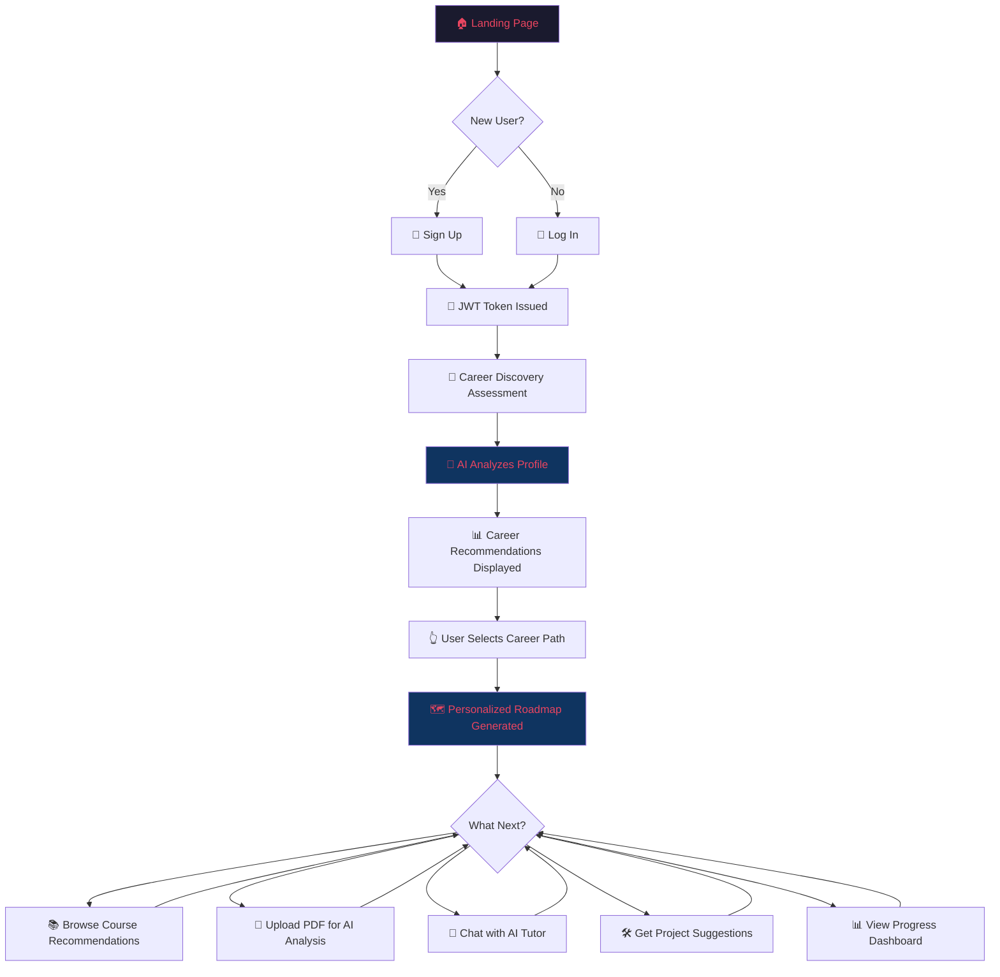

# 🚀 Career Pilot — AI Career Guidance & Learning Assistant

> **Brainware AI Hackathon 2026 | Team FinessBaba**
>
> *"Empower students to discover the right career path, learn effectively, and achieve their goals with the power of AI."*

---

## 📌 Table of Contents

1. [Project Overview](#-project-overview)
2. [Problem Statement](#-problem-statement)
3. [Unique Selling Proposition (USP)](#-unique-selling-proposition-usp)
4. [Target Users](#-target-users)
5. [System Architecture](#-system-architecture)
6. [Tech Stack](#-tech-stack)
7. [Core Features (MVP)](#-core-features-mvp)
8. [User Flow](#-user-flow)
9. [Database Schema](#-database-schema)
10. [API Design](#-api-design)
11. [Development Roadmap & Sprint Plan](#-development-roadmap--sprint-plan)
12. [Milestone Tracker](#-milestone-tracker)
13. [Future Scope (v2.0)](#-future-scope-v20)
14. [Risk Analysis & Mitigation](#-risk-analysis--mitigation)
15. [Demo & Presentation Strategy](#-demo--presentation-strategy)
16. [Team Allocation](#-team-allocation)
17. [Key Hackathon Deadlines](#-key-hackathon-deadlines)

---

## 🎯 Project Overview

**Career Pilot** is an AI-powered, end-to-end career guidance and learning assistant designed specifically for students and early-career professionals. It eliminates the guesswork from career planning by combining intelligent interest analysis, personalized roadmap generation, curated course recommendations, AI-driven PDF learning, and an always-available AI tutor — all within a single, cohesive platform.

Unlike scattered career quizzes or generic guidance portals, Career Pilot creates a **living, adaptive career plan** that evolves with the user's progress.

---

## 🔍 Problem Statement

India produces over **1.5 million engineering graduates annually**, yet a significant majority face:

| Problem | Impact |
| :--- | :--- |
| **No structured career guidance** | Students choose careers based on peer pressure, not aptitude |
| **Information overload** | Hundreds of courses, no clarity on what to learn first |
| **No personalized learning paths** | Generic advice that doesn't account for individual strengths |
| **Expensive career counseling** | Professional guidance costs ₹5,000–₹50,000+ per session |
| **No progress tracking** | Students start courses but lack accountability and direction |

> **Career Pilot solves this by offering free, AI-personalized, end-to-end career navigation — from discovery to job-readiness.**

---

## 💎 Unique Selling Proposition (USP)

| Feature | Career Pilot ✅ | Generic Career Portals ❌ |
| :--- | :--- | :--- |
| AI-driven career discovery based on multi-dimensional profiling | ✅ Deep analysis of interests, goals, subjects & skills | ❌ Basic quiz-style assessments |
| Personalized, stage-wise roadmap (Beginner → Advanced) | ✅ Adaptive milestones that update with progress | ❌ Static, one-size-fits-all advice |
| Smart course curation (free + paid, multi-platform) | ✅ YouTube, Coursera, Udemy, freeCodeCamp, Kaggle | ❌ Single platform or no curation |
| AI PDF/Notes Assistant with MCQ generation | ✅ Upload any PDF → get summaries, flashcards, Q&A | ❌ Not available |
| 24/7 AI Tutor with code debugging | ✅ Contextual explanations, multi-lingual support | ❌ Forum-based, delayed responses |
| Portfolio-mapped project suggestions | ✅ Stage-appropriate projects tied to roadmap | ❌ Generic project lists |
| **Completely free for students** | ✅ | ❌ Most charge per session |

### What makes Career Pilot stand out in this hackathon?

1. **AI is not a gimmick — it's the backbone**: Every feature runs through an AI engine (OpenAI API), from career matching to document analysis.
2. **Full lifecycle coverage**: We don't just recommend a career — we build the entire learning path, recommend courses, help study, tutor live, and track progress.
3. **Real-world applicability**: Can be deployed and used by Brainware University students *today*.
4. **Scalability**: Architecture supports extending to any career domain (medical, legal, creative) with minimal changes.

---

## 👥 Target Users

| User Segment | Needs |
| :--- | :--- |
| **College Students (Primary)** | Career direction, skill-building roadmap, course discovery |
| **Final-Year / Graduating Students** | Job-readiness, portfolio projects, interview prep |
| **Career Switchers** | Re-skilling paths, understanding new domains |
| **Self-Learners** | Structured learning from uploaded notes/PDFs |

---

## 🏗 System Architecture

```
┌─────────────────────────────────────────────────────────────────┐
│                        CLIENT (Browser)                         │
│                                                                 │
│   React.js + Bootstrap + React Router + Axios                   │
│   ┌──────────┐ ┌──────────┐ ┌──────────┐ ┌──────────────────┐  │
│   │  Auth UI  │ │ Career   │ │ Roadmap  │ │ Course/PDF/Tutor │  │
│   │  Module   │ │ Discovery│ │ Viewer   │ │    Modules       │  │
│   └────┬─────┘ └────┬─────┘ └────┬─────┘ └────────┬─────────┘  │
│        │             │            │                 │            │
└────────┼─────────────┼────────────┼─────────────────┼────────────┘
         │             │            │                 │
         ▼             ▼            ▼                 ▼
   ╔═══════════════════════════════════════════════════════════╗
   ║                   REST API LAYER                          ║
   ║              Node.js + Express.js Server                  ║
   ║                                                           ║
   ║  ┌─────────────┐  ┌─────────────┐  ┌─────────────────┐   ║
   ║  │ Auth Routes  │  │ Career API  │  │ AI Integration  │   ║
   ║  │ (JWT+bcrypt) │  │   Routes    │  │   Controller    │   ║
   ║  └──────┬──────┘  └──────┬──────┘  └────────┬────────┘   ║
   ║         │                │                   │            ║
   ╚═════════╪════════════════╪═══════════════════╪════════════╝
             │                │                   │
      ┌──────▼──────┐  ┌─────▼──────┐   ┌────────▼────────┐
      │  PostgreSQL  │  │  PostgreSQL │   │   OpenAI API    │
      │  (Users,     │  │  (Careers,  │   │  (GPT-4/3.5)    │
      │   Auth)      │  │  Roadmaps,  │   │                 │
      │              │  │  Courses,   │   │  ┌────────────┐ │
      │              │  │  Progress)  │   │  │ pdf-parse  │ │
      │              │  │             │   │  │ multer     │ │
      └──────────────┘  └─────────────┘   │  └────────────┘ │
                                          └─────────────────┘
```

### Architecture Highlights

- **Monolithic Backend (MVP-appropriate)**: Single Express.js server handles all routes — simple to develop, test, and deploy within hackathon timelines.
- **Stateless API Design**: JWT-based authentication ensures no server-side sessions, enabling horizontal scaling later.
- **AI Service Decoupling**: All OpenAI API calls go through a dedicated `AIController` — easy to swap providers or add rate limiting.
- **File Processing Pipeline**: PDF uploads → `multer` (storage) → `pdf-parse` (text extraction) → OpenAI (analysis) — clean separation of concerns.

---

## 🛠 Tech Stack

| Layer | Technology | Justification |
| :--- | :--- | :--- |
| **Frontend** | React.js | Component-based, fast rendering, huge ecosystem |
| **UI Framework** | Bootstrap 5 | Rapid prototyping, responsive out-of-box |
| **Routing** | React Router v6 | Client-side routing with protected routes |
| **HTTP Client** | Axios | Promise-based, interceptor support for auth tokens |
| **Backend** | Node.js + Express.js | Non-blocking I/O, fast API development |
| **Database** | PostgreSQL | ACID compliance, complex queries, relational data |
| **Authentication** | JWT + bcrypt | Industry-standard stateless auth + secure hashing |
| **AI Engine** | OpenAI API (GPT-4 / GPT-3.5-turbo) | State-of-the-art LLM for career analysis, tutoring |
| **PDF Processing** | pdf-parse + multer | Text extraction from uploaded documents |
| **Deployment (Frontend)** | Vercel | Zero-config React deployment, global CDN |
| **Deployment (Backend)** | Render | Free tier, auto-deploy from Git |
| **Deployment (Database)** | Supabase / Railway | Managed PostgreSQL with free tiers |

### Dev Tools & Environment

| Tool | Purpose |
| :--- | :--- |
| VS Code | Primary IDE |
| Figma / Excalidraw | Wireframing & UI Mockups |
| Postman | API testing |
| Git + GitHub | Version control & collaboration |
| ESLint + Prettier | Code quality & formatting |

---

## ⚡ Core Features (MVP)

### Module 1 — 🔐 Authentication System

| Feature | Implementation |
| :--- | :--- |
| User Registration | Name, email, password (hashed with bcrypt) |
| User Login | Email/password → JWT token issued |
| JWT Authentication | Token stored in localStorage, sent via `Authorization` header |
| Protected Routes | Middleware validates JWT on all private endpoints |
| Session Management | Auto-logout on token expiry, refresh flow |

---

### Module 2 — 🧭 AI Career Discovery Engine

The **core differentiator** of Career Pilot. This module performs multi-dimensional interest profiling to produce actionable career recommendations.

**Assessment Parameters:**
- Personal interests (technology, science, arts, business, etc.)
- Long-term professional goals
- Favorite academic subjects
- Current baseline skills (programming, math, communication, etc.)

**AI Processing Pipeline:**
```
User Input → Structured Prompt Engineering → OpenAI GPT → 
Career Compatibility Scoring → Top 3-5 Career Recommendations 
with Justifications
```

**Recommended Career Paths Include:**
- AI/ML Engineer
- Data Scientist
- Full Stack Developer
- Cybersecurity Analyst
- UI/UX Designer
- Cloud Architect
- DevOps Specialist

> Each recommendation includes a **"Why this fits you"** explanation — not just a label, but a reasoned mapping to the user's profile.

---

### Module 3 — 🗺 Personalized Career Roadmap

Once a career path is selected, the system generates a **structured, stage-wise learning path**:

```
📍 Beginner Stage
   └── Python Fundamentals → Data Structures & Algorithms
       
📍 Intermediate Stage  
   └── Machine Learning → Statistics & Probability → Real Projects
       
📍 Advanced Stage
   └── Deep Learning → Specialization → Portfolio Building → Job Prep
```

**Key Features:**
- Step-by-step milestones with clear progression
- Progress tracking with completion markers
- Dynamic adaptation based on user's reported progress
- Stored in database for persistence across sessions

---

### Module 4 — 📚 Course Recommendation Engine

Smart course curation based on three explicit constraints:

| Constraint | Options |
| :--- | :--- |
| **Career Goal** | Mapped from the user's selected career path |
| **Skill Level** | Beginner / Intermediate / Advanced |
| **Budget** | Free / Paid / Both |

**Supported Platforms:**

| Platform | Type | Content Focus |
| :--- | :--- | :--- |
| YouTube | Free | Video tutorials, community content |
| freeCodeCamp | Free | Interactive coding curriculum |
| Kaggle | Free | Data science competitions & datasets |
| Coursera | Free + Paid | University-backed courses & certificates |
| Udemy | Paid | Professional bootcamps & specializations |

---

### Module 5 — 📄 AI PDF & Notes Assistant

An on-demand document intelligence system:

| Capability | Description |
| :--- | :--- |
| **Document Upload** | PDF, PPT, Markdown via multer file handling |
| **Auto-Summarization** | Multi-page documents → structured key takeaways |
| **Question Generation** | Conceptual questions + MCQs + flashcards |
| **Contextual Explainer** | Deep-dive explanations for complex formulas/concepts |

**Processing Flow:**
```
File Upload (multer) → Text Extraction (pdf-parse) → 
Prompt Engineering → OpenAI API → Structured Output 
(Summary / Questions / Explanations)
```

---

### Module 6 — 🤖 AI Tutor (24/7 Chat Interface)

| Feature | Details |
| :--- | :--- |
| Real-time Chat UI | Conversational interface with message history |
| Code Explanations | Paste code → get line-by-line explanations |
| Debugging Assistance | AI identifies bugs and suggests fixes |
| Multi-lingual Support | Concept translations across languages |
| Personalized Pacing | Adapts complexity based on user's question level |

---

### Module 7 — 🛠 Project Recommendation System

Stage-appropriate project suggestions for portfolio building:

| Stage | Example Projects |
| :--- | :--- |
| **Beginner** | Titanic Survival Prediction, To-Do App, Calculator |
| **Intermediate** | Movie Recommendation Engine, Weather Dashboard |
| **Advanced** | AI Chatbot, Resume Screening AI, Full-Stack SaaS |

---

### Module 8 — 📊 Progress Tracking Dashboard

| Metric | Tracked |
| :--- | :--- |
| Roadmap milestones | Completed / In-Progress / Upcoming |
| Courses completed | Count + platform breakdown |
| PDFs analyzed | Documents processed by AI assistant |
| Study streaks | Daily engagement tracking |
| Overall readiness score | Composite metric for job-readiness |

---

## 🔄 User Flow



---

## 🗄 Database Schema

```sql
-- Users Table
CREATE TABLE users (
    id          SERIAL PRIMARY KEY,
    name        VARCHAR(100) NOT NULL,
    email       VARCHAR(255) UNIQUE NOT NULL,
    password    VARCHAR(255) NOT NULL,  -- bcrypt hashed
    created_at  TIMESTAMP DEFAULT CURRENT_TIMESTAMP,
    updated_at  TIMESTAMP DEFAULT CURRENT_TIMESTAMP
);

-- User Profiles (Assessment Data)
CREATE TABLE user_profiles (
    id              SERIAL PRIMARY KEY,
    user_id         INTEGER REFERENCES users(id) ON DELETE CASCADE,
    interests       JSONB,          -- Array of interest areas
    goals           TEXT,           -- Long-term career goals
    subjects        JSONB,          -- Favorite academic subjects
    skills          JSONB,          -- Current skill levels
    assessed_at     TIMESTAMP DEFAULT CURRENT_TIMESTAMP
);

-- Career Recommendations
CREATE TABLE career_recommendations (
    id              SERIAL PRIMARY KEY,
    user_id         INTEGER REFERENCES users(id) ON DELETE CASCADE,
    career_path     VARCHAR(100) NOT NULL,
    match_score     DECIMAL(5,2),   -- AI confidence score
    reasoning       TEXT,           -- Why this career fits
    selected        BOOLEAN DEFAULT FALSE,
    created_at      TIMESTAMP DEFAULT CURRENT_TIMESTAMP
);

-- Roadmaps
CREATE TABLE roadmaps (
    id              SERIAL PRIMARY KEY,
    user_id         INTEGER REFERENCES users(id) ON DELETE CASCADE,
    career_path     VARCHAR(100) NOT NULL,
    stages          JSONB,          -- Beginner/Intermediate/Advanced milestones
    current_stage   VARCHAR(20) DEFAULT 'beginner',
    created_at      TIMESTAMP DEFAULT CURRENT_TIMESTAMP
);

-- Roadmap Progress
CREATE TABLE roadmap_progress (
    id              SERIAL PRIMARY KEY,
    roadmap_id      INTEGER REFERENCES roadmaps(id) ON DELETE CASCADE,
    milestone       VARCHAR(255) NOT NULL,
    stage           VARCHAR(20) NOT NULL,
    completed       BOOLEAN DEFAULT FALSE,
    completed_at    TIMESTAMP
);

-- Course Recommendations
CREATE TABLE courses (
    id              SERIAL PRIMARY KEY,
    title           VARCHAR(255) NOT NULL,
    platform        VARCHAR(50) NOT NULL,
    url             TEXT NOT NULL,
    career_path     VARCHAR(100),
    skill_level     VARCHAR(20),    -- beginner/intermediate/advanced
    is_free         BOOLEAN DEFAULT TRUE,
    rating          DECIMAL(3,2)
);

-- PDF Documents
CREATE TABLE documents (
    id              SERIAL PRIMARY KEY,
    user_id         INTEGER REFERENCES users(id) ON DELETE CASCADE,
    filename        VARCHAR(255) NOT NULL,
    file_path       TEXT NOT NULL,
    summary         TEXT,
    questions       JSONB,          -- Generated questions/MCQs
    uploaded_at     TIMESTAMP DEFAULT CURRENT_TIMESTAMP
);

-- Chat History (AI Tutor)
CREATE TABLE chat_history (
    id              SERIAL PRIMARY KEY,
    user_id         INTEGER REFERENCES users(id) ON DELETE CASCADE,
    role            VARCHAR(20) NOT NULL,  -- 'user' or 'assistant'
    message         TEXT NOT NULL,
    created_at      TIMESTAMP DEFAULT CURRENT_TIMESTAMP
);

-- User Progress Tracking
CREATE TABLE user_progress (
    id                  SERIAL PRIMARY KEY,
    user_id             INTEGER REFERENCES users(id) ON DELETE CASCADE,
    courses_completed   INTEGER DEFAULT 0,
    pdfs_analyzed       INTEGER DEFAULT 0,
    tutor_sessions      INTEGER DEFAULT 0,
    streak_days         INTEGER DEFAULT 0,
    last_active         TIMESTAMP DEFAULT CURRENT_TIMESTAMP
);
```

---

## 🌐 API Design

### Authentication Endpoints

| Method | Endpoint | Description |
| :--- | :--- | :--- |
| `POST` | `/api/auth/register` | Create new user account |
| `POST` | `/api/auth/login` | Authenticate & return JWT |
| `GET` | `/api/auth/profile` | Get current user profile (Protected) |

### Career Discovery Endpoints

| Method | Endpoint | Description |
| :--- | :--- | :--- |
| `POST` | `/api/career/assess` | Submit assessment data |
| `GET` | `/api/career/recommendations/:userId` | Get AI career recommendations |
| `PUT` | `/api/career/select/:recommendationId` | Select a career path |

### Roadmap Endpoints

| Method | Endpoint | Description |
| :--- | :--- | :--- |
| `GET` | `/api/roadmap/:userId` | Get user's personalized roadmap |
| `PUT` | `/api/roadmap/progress/:milestoneId` | Mark milestone as completed |

### Course Endpoints

| Method | Endpoint | Description |
| :--- | :--- | :--- |
| `GET` | `/api/courses` | Get filtered course recommendations |
| `GET` | `/api/courses/:careerPath` | Get courses for a specific career |

### PDF Assistant Endpoints

| Method | Endpoint | Description |
| :--- | :--- | :--- |
| `POST` | `/api/pdf/upload` | Upload document for AI analysis |
| `GET` | `/api/pdf/summary/:docId` | Get AI-generated summary |
| `GET` | `/api/pdf/questions/:docId` | Get generated questions/MCQs |

### AI Tutor Endpoints

| Method | Endpoint | Description |
| :--- | :--- | :--- |
| `POST` | `/api/tutor/chat` | Send message to AI tutor |
| `GET` | `/api/tutor/history/:userId` | Get chat history |

### Progress Endpoints

| Method | Endpoint | Description |
| :--- | :--- | :--- |
| `GET` | `/api/progress/:userId` | Get user progress dashboard data |

---

## 📅 Development Roadmap & Sprint Plan

### Phase 1 — Foundation (Days 1–3)

| Task | Deliverable | Owner |
| :--- | :--- | :--- |
| Requirement gathering & feature finalization | Feature List & User Flow | Full Team |
| Design wireframes (all major screens) | UI Mockups (Figma/Excalidraw) | Frontend Lead |
| Setup React project + Bootstrap + Router | Frontend Skeleton | Frontend Dev |
| Setup Node.js + Express + folder structure | Working Backend Server | Backend Lead |
| Design & create PostgreSQL schema | Database Schema | Backend Dev |

### Phase 2 — Core Modules (Days 4–10)

| Task | Deliverable | Priority |
| :--- | :--- | :--- |
| Authentication Module (Register, Login, JWT, Protected Routes) | Secure User Access | 🔴 Critical |
| Career Discovery Module (Assessment Form + AI Matching) | Career Suggestions | 🔴 Critical |
| Roadmap Module (Store & Display Personalized Learning Path) | Personalized Roadmap | 🔴 Critical |
| Course Recommendation Module (Filter by Career/Level/Budget) | Course Recommendations | 🟡 High |

### Phase 3 — AI Modules (Days 11–16)

| Task | Deliverable | Priority |
| :--- | :--- | :--- |
| PDF Assistant (Upload → Extract → Summarize → Generate Q&A) | AI PDF Assistant | 🟡 High |
| AI Tutor Chat Interface (OpenAI integration + Chat UI) | AI Tutor Chatbot | 🟡 High |
| Progress Tracking Dashboard | Progress Dashboard | 🟢 Medium |

### Phase 4 — Polish & Deploy (Days 17–20)

| Task | Deliverable |
| :--- | :--- |
| End-to-end testing of all modules | Bug-Free Application |
| Test all API endpoints (Postman) | Verified API Layer |
| Deploy Frontend (Vercel) | Live Frontend |
| Deploy Backend (Render) | Live Backend |
| Deploy Database (Supabase/Railway) | Live Database |
| Setup environment variables & secrets | Secure Production Config |
| Prepare demo flow & presentation | Hackathon-Ready Demo |

---

## 📊 Milestone Tracker

```
✅ Phase 1 — Foundation
   ├── [ ] Requirements finalized
   ├── [ ] Wireframes designed
   ├── [ ] Frontend skeleton ready
   ├── [ ] Backend server running
   └── [ ] Database schema created

🔧 Phase 2 — Core Modules
   ├── [ ] Auth module working
   ├── [ ] Career discovery engine ready
   ├── [ ] Roadmap generation working
   └── [ ] Course recommendations live

🤖 Phase 3 — AI Modules
   ├── [ ] PDF assistant functional
   ├── [ ] AI tutor chat working
   └── [ ] Progress dashboard built

🚀 Phase 4 — Ship It
   ├── [ ] All modules tested
   ├── [ ] Frontend deployed (Vercel)
   ├── [ ] Backend deployed (Render)
   ├── [ ] Database deployed (Supabase)
   └── [ ] Demo prepared
```

---

## 🔮 Future Scope (v2.0)

These features transform Career Pilot from a learning guide into a **full career transition platform**:

| Feature | Description | Impact |
| :--- | :--- | :--- |
| **📄 Resume Analyzer** | Upload resume → AI scores it against ATS systems → suggests improvements | Directly improves job application success rate |
| **🎤 Interview Preparation Suite** | AI-powered mock interviews with real-time feedback, body language tips | Reduces interview anxiety, improves performance |
| **💼 Live Job & Internship Matching** | Scrape and aggregate real-time job listings matched to user's roadmap stage | Closes the gap between learning and employment |
| **🗣 AI Voice Mentor** | Speech-driven learning interface, conversational training | Accessibility for non-text learners |
| **👥 Community Features** | Peer study groups, mentorship matching, discussion forums | Social learning & accountability |
| **🎮 Gamification** | XP points, badges, leaderboards, daily challenges | Increases engagement & retention |
| **🌐 Multi-language Support** | Platform UI + AI responses in Hindi, Bengali, Tamil, etc. | Makes the tool accessible to Tier-2/3 city students |
| **📱 Mobile App** | React Native cross-platform app | On-the-go learning |

---

## ⚠️ Risk Analysis & Mitigation

| Risk | Probability | Impact | Mitigation Strategy |
| :--- | :--- | :--- | :--- |
| **OpenAI API rate limits / costs** | Medium | High | Use GPT-3.5-turbo for non-critical calls; implement caching for repeated queries; set up usage quotas per user |
| **Scope creep during hackathon** | High | High | Strictly prioritize MVP modules (Auth → Career → Roadmap → Courses); defer PDF/Tutor if behind schedule |
| **Database performance issues** | Low | Medium | Index frequently queried columns; use connection pooling; JSONB for flexible schema |
| **Team member unavailability** | Medium | Medium | Document everything; ensure no single-person dependencies; pair programming for critical modules |
| **Deployment failures** | Medium | High | Test deployment early (Day 12); have fallback deployment options (Railway, Fly.io) |
| **Poor AI response quality** | Medium | High | Invest time in prompt engineering; test with diverse inputs; add guardrails for inappropriate outputs |

---

## 🎬 Demo & Presentation Strategy

### Demo Flow (5 minutes)

| Step | Action | Duration |
| :--- | :--- | :--- |
| 1 | **Hook**: Show the problem (confused student + career stats) | 30s |
| 2 | **Sign Up**: Quick registration on Career Pilot | 20s |
| 3 | **Career Discovery**: Fill assessment → Show AI recommendations | 60s |
| 4 | **Roadmap**: Display personalized learning path for selected career | 45s |
| 5 | **Courses**: Show filtered recommendations (free + paid) | 30s |
| 6 | **PDF Assistant**: Upload a PDF → Show summary + MCQs | 60s |
| 7 | **AI Tutor**: Ask a coding question → Get real-time answer | 45s |
| 8 | **Dashboard**: Show progress tracking | 20s |
| 9 | **Close**: Future vision + impact statement | 30s |

### Presentation Tips

- 🎯 **Lead with the problem**, not the solution
- 📊 **Show real data**: "68% of Indian students are unsure about their career path"
- 💡 **Live demo > slides**: Run the actual application on stage
- 🎨 **Keep the UI polished**: First impressions matter — judges evaluate aesthetics
- ❓ **Anticipate questions**: API cost model, scalability, data privacy, differentiation

---

## 👨‍💻 Team Allocation

| Role | Responsibility | Key Skills Needed |
| :--- | :--- | :--- |
| **Frontend Lead** | React UI, routing, responsive design, API integration | React.js, Bootstrap, Axios |
| **Backend Lead** | Express.js server, API routes, JWT auth, middleware | Node.js, Express, PostgreSQL |
| **AI Engineer** | Prompt engineering, OpenAI integration, PDF processing | Python/JS, OpenAI API, NLP |
| **Database & DevOps** | Schema design, deployment, CI/CD, environment setup | PostgreSQL, Vercel, Render |
| **UI/UX & Presenter** | Wireframes, design system, demo preparation, pitch | Figma, presentation skills |

---

## 📆 Key Hackathon Deadlines

| Milestone | Date | Status |
| :--- | :--- | :--- |
| **Proposal Submission** | June 22, 2026 | ⏳ Upcoming |
| **Prototype Screening** | 2nd Week of July 2026 | 🔜 |
| **Prototype Shortlisting** | 4th Week of July 2026 | 🔜 |
| **Final Presentation** | August 2026 (exact TBA) | 🔜 |

> **⚡ Action Item**: Submit proposal via the [official Google Form](https://docs.google.com/forms/d/e/1FAIpQLScRTibBU0jWGa2KRuu6MZyII2OMWVusAUUGIKzFFvS_F_khcg/viewform?usp=dialog) before **June 22, 2026**.

---

## 📁 Recommended Project Structure

```
career-pilot/
├── client/                     # React Frontend
│   ├── public/
│   ├── src/
│   │   ├── components/
│   │   │   ├── Auth/           # Login, Register components
│   │   │   ├── Career/         # Assessment form, Recommendations
│   │   │   ├── Roadmap/        # Roadmap viewer, Progress markers
│   │   │   ├── Courses/        # Course cards, Filters
│   │   │   ├── PDF/            # Upload UI, Summary viewer
│   │   │   ├── Tutor/          # Chat interface
│   │   │   ├── Dashboard/      # Progress tracking
│   │   │   └── Layout/         # Navbar, Sidebar, Footer
│   │   ├── services/           # Axios API calls
│   │   ├── context/            # Auth context, User state
│   │   ├── utils/              # Helper functions
│   │   ├── App.js
│   │   └── index.js
│   └── package.json
├── server/                     # Node.js Backend
│   ├── controllers/            # Business logic
│   │   ├── authController.js
│   │   ├── careerController.js
│   │   ├── roadmapController.js
│   │   ├── courseController.js
│   │   ├── pdfController.js
│   │   ├── tutorController.js
│   │   └── progressController.js
│   ├── models/                 # Database models
│   ├── routes/                 # API route definitions
│   ├── middleware/             # JWT verification, error handling
│   ├── config/                 # DB connection, environment
│   ├── uploads/                # Stored PDF files
│   ├── server.js               # Entry point
│   └── package.json
├── database/
│   └── schema.sql              # PostgreSQL schema
├── docs/
│   ├── wireframes/             # UI mockups
│   └── api-docs.md             # API documentation
├── .env.example                # Environment variable template
├── .gitignore
└── README.md
```

---

## 🏁 Summary

**Career Pilot** is not just another career quiz — it's a **comprehensive, AI-native career navigation platform** that takes a student from "I don't know what to do" to "I have a clear roadmap, curated courses, AI-powered study tools, and a portfolio of projects." Built with a modern, scalable tech stack and designed for real-world impact, it's a project that solves a genuine, widespread problem for millions of Indian students.

> **Let's build something that doesn't just win a hackathon — let's build something students actually use.** 🚀

---

*Document Version: 1.0 | Last Updated: June 3, 2026 | Team FinessBaba*
