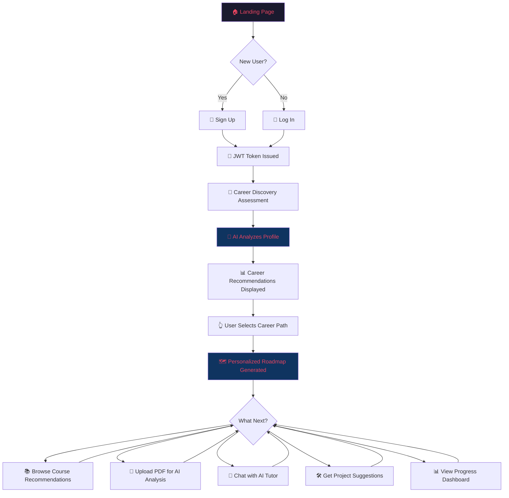

# 🚀 Career Pilot — AI Career Guidance & Learning Assistant

> **Brainware AI Hackathon 2026 | Team FinessBaba**
>
> *"Empower students to discover the right career path, learn effectively, and achieve their goals with the power of AI."*

---

## 📌 Table of Contents

1. [Project Overview](#-project-overview)
2. [Problem Statement](#-problem-statement)
3. [Unique Selling Proposition (USP)](#-unique-selling-proposition-usp)
4. [Target Users](#-target-users)
5. [System Architecture](#-system-architecture)
6. [Tech Stack](#-tech-stack)
7. [Core Features (MVP)](#-core-features-mvp)
8. [User Flow](#-user-flow)
9. [Database Schema](#-database-schema)
10. [API Design](#-api-design)
11. [Development Roadmap & Sprint Plan](#-development-roadmap--sprint-plan)
12. [Milestone Tracker](#-milestone-tracker)
13. [Future Scope (v2.0)](#-future-scope-v20)
14. [Risk Analysis & Mitigation](#-risk-analysis--mitigation)
15. [Demo & Presentation Strategy](#-demo--presentation-strategy)
16. [Team Allocation](#-team-allocation)
17. [Key Hackathon Deadlines](#-key-hackathon-deadlines)

---

## 🎯 Project Overview

**Career Pilot** is an AI-powered, end-to-end career guidance and learning assistant designed specifically for students and early-career professionals. It eliminates the guesswork from career planning by combining intelligent interest analysis, personalized roadmap generation, curated course recommendations, AI-driven PDF learning, and an always-available AI tutor — all within a single, cohesive platform.

Unlike scattered career quizzes or generic guidance portals, Career Pilot creates a **living, adaptive career plan** that evolves with the user's progress.

---

## 🔍 Problem Statement

India produces over **1.5 million engineering graduates annually**, yet a significant majority face:

| Problem | Impact |
| :--- | :--- |
| **No structured career guidance** | Students choose careers based on peer pressure, not aptitude |
| **Information overload** | Hundreds of courses, no clarity on what to learn first |
| **No personalized learning paths** | Generic advice that doesn't account for individual strengths |
| **Expensive career counseling** | Professional guidance costs ₹5,000–₹50,000+ per session |
| **No progress tracking** | Students start courses but lack accountability and direction |

> **Career Pilot solves this by offering free, AI-personalized, end-to-end career navigation — from discovery to job-readiness.**

---

## 💎 Unique Selling Proposition (USP)

| Feature | Career Pilot ✅ | Generic Career Portals ❌ |
| :--- | :--- | :--- |
| AI-driven career discovery based on multi-dimensional profiling | ✅ Deep analysis of interests, goals, subjects & skills | ❌ Basic quiz-style assessments |
| Personalized, stage-wise roadmap (Beginner → Advanced) | ✅ Adaptive milestones that update with progress | ❌ Static, one-size-fits-all advice |
| Smart course curation (free + paid, multi-platform) | ✅ YouTube, Coursera, Udemy, freeCodeCamp, Kaggle | ❌ Single platform or no curation |
| AI PDF/Notes Assistant with MCQ generation | ✅ Upload any PDF → get summaries, flashcards, Q&A | ❌ Not available |
| 24/7 AI Tutor with code debugging | ✅ Contextual explanations, multi-lingual support | ❌ Forum-based, delayed responses |
| Portfolio-mapped project suggestions | ✅ Stage-appropriate projects tied to roadmap | ❌ Generic project lists |
| **Completely free for students** | ✅ | ❌ Most charge per session |

### What makes Career Pilot stand out in this hackathon?

1. **AI is not a gimmick — it's the backbone**: Every feature runs through an AI engine (OpenAI API), from career matching to document analysis.
2. **Full lifecycle coverage**: We don't just recommend a career — we build the entire learning path, recommend courses, help study, tutor live, and track progress.
3. **Real-world applicability**: Can be deployed and used by Brainware University students *today*.
4. **Scalability**: Architecture supports extending to any career domain (medical, legal, creative) with minimal changes.

---

## 👥 Target Users

| User Segment | Needs |
| :--- | :--- |
| **College Students (Primary)** | Career direction, skill-building roadmap, course discovery |
| **Final-Year / Graduating Students** | Job-readiness, portfolio projects, interview prep |
| **Career Switchers** | Re-skilling paths, understanding new domains |
| **Self-Learners** | Structured learning from uploaded notes/PDFs |

---

## 🏗 System Architecture

```
┌─────────────────────────────────────────────────────────────────┐
│                        CLIENT (Browser)                         │
│                                                                 │
│   Next.js 15 (App Router) + React Server Components             │
│   ┌──────────┐ ┌──────────┐ ┌──────────┐ ┌──────────────────┐  │
│   │  Auth UI  │ │ Career   │ │ Roadmap  │ │ Course/PDF/Tutor │  │
│   │  Module   │ │ Discovery│ │ Viewer   │ │    Modules       │  │
│   └────┬─────┘ └────┬─────┘ └────┬─────┘ └────────┬─────────┘  │
│        │             │            │                 │            │
└────────┼─────────────┼────────────┼─────────────────┼────────────┘
         │             │            │                 │
         ▼             ▼            ▼                 ▼
   ╔═══════════════════════════════════════════════════════════╗
   ║              NEXT.JS API ROUTES LAYER                     ║
   ║         /app/api/* (Route Handlers + Server Actions)      ║
   ║                                                           ║
   ║  ┌─────────────┐  ┌─────────────┐  ┌─────────────────┐   ║
   ║  │ Auth Routes  │  │ Career API  │  │ AI Integration  │   ║
   ║  │ (NextAuth)   │  │   Routes    │  │    Service       │   ║
   ║  └──────┬──────┘  └──────┬──────┘  └────────┬────────┘   ║
   ║         │                │                   │            ║
   ╚═════════╪════════════════╪═══════════════════╪════════════╝
             │                │                   │
      ┌──────▼──────┐  ┌─────▼──────┐   ┌────────▼────────┐
      │   MongoDB    │  │   MongoDB   │   │   OpenAI API    │
      │  (Users,     │  │  (Careers,  │   │  (GPT-4/3.5)    │
      │   Auth)      │  │  Roadmaps,  │   │                 │
      │  [Mongoose]  │  │  Courses,   │   │  ┌────────────┐ │
      │              │  │  Progress)  │   │  │ pdf-parse  │ │
      │              │  │ [Mongoose]  │   │  │ formidable │ │
      └──────────────┘  └─────────────┘   │  └────────────┘ │
                                          └─────────────────┘
```

### Architecture Highlights

- **Full-Stack Next.js (MVP-appropriate)**: Single Next.js application handles both frontend rendering and API routes — eliminates the need for a separate backend server, simplifying development and deployment.
- **App Router with Server Components**: Leverages React Server Components for faster page loads, reduced client-side JavaScript, and seamless data fetching.
- **NextAuth.js Integration**: Battle-tested authentication with support for credentials, OAuth providers, and session management — no custom JWT middleware needed.
- **MongoDB + Mongoose ODM**: Flexible document-based storage ideal for evolving schemas during rapid hackathon development; Mongoose provides schema validation and query building.
- **AI Service Decoupling**: All OpenAI API calls go through a dedicated service module — easy to swap providers or add rate limiting.
- **File Processing Pipeline**: PDF uploads → `formidable` (parsing) → `pdf-parse` (text extraction) → OpenAI (analysis) — clean separation of concerns.

---

## 🛠 Tech Stack

| Layer | Technology | Justification |
| :--- | :--- | :--- |
| **Full-Stack Framework** | Next.js 15 (App Router) | Unified frontend + backend, Server Components, API routes, file-based routing |
| **UI Library** | React 19 | Component-based, fast rendering, huge ecosystem |
| **Styling** | Tailwind CSS 4 + shadcn/ui | Utility-first styling with accessible, pre-built component library |
| **Database** | MongoDB (Atlas) | Flexible document-based storage, free cloud tier, fast iteration |
| **ODM** | Mongoose 8 | Schema validation, middleware hooks, query building for MongoDB |
| **Authentication** | NextAuth.js (Auth.js v5) | Built-in session management, credential + OAuth support, middleware-based route protection |
| **AI Engine** | OpenAI API (GPT-4 / GPT-3.5-turbo) | State-of-the-art LLM for career analysis, tutoring |
| **PDF Processing** | pdf-parse + formidable | Text extraction from uploaded documents |
| **Deployment** | Vercel | Zero-config Next.js deployment, serverless functions, global CDN |
| **Database Hosting** | MongoDB Atlas | Free M0 tier, managed cloud database, built-in monitoring |

### Dev Tools & Environment

| Tool | Purpose |
| :--- | :--- |
| VS Code / Cursor | Primary IDE |
| Figma / Excalidraw | Wireframing & UI Mockups |
| Thunder Client / Postman | API testing |
| Git + GitHub | Version control & collaboration |
| ESLint + Prettier | Code quality & formatting |
| MongoDB Compass | Database GUI for development |

---

## ⚡ Core Features (MVP)

### Module 1 — 🔐 Authentication System

| Feature | Implementation |
| :--- | :--- |
| User Registration | Name, email, password (hashed with bcrypt via NextAuth credentials provider) |
| User Login | Email/password → NextAuth session created (JWT strategy) |
| NextAuth.js Sessions | Secure HTTP-only cookies, automatic CSRF protection |
| Protected Routes | NextAuth middleware protects routes at the edge; `useSession()` for client-side checks |
| OAuth Support (Stretch) | One-click sign-in via Google/GitHub providers |
| Session Management | Automatic refresh, server-side session validation |

---

### Module 2 — 🧭 AI Career Discovery Engine

The **core differentiator** of Career Pilot. This module performs multi-dimensional interest profiling to produce actionable career recommendations.

**Assessment Parameters:**
- Personal interests (technology, science, arts, business, etc.)
- Long-term professional goals
- Favorite academic subjects
- Current baseline skills (programming, math, communication, etc.)

**AI Processing Pipeline:**
```
User Input → Structured Prompt Engineering → OpenAI GPT → 
Career Compatibility Scoring → Top 3-5 Career Recommendations 
with Justifications
```

**Recommended Career Paths Include:**
- AI/ML Engineer
- Data Scientist
- Full Stack Developer
- Cybersecurity Analyst
- UI/UX Designer
- Cloud Architect
- DevOps Specialist

> Each recommendation includes a **"Why this fits you"** explanation — not just a label, but a reasoned mapping to the user's profile.

---

### Module 3 — 🗺 Personalized Career Roadmap

Once a career path is selected, the system generates a **structured, stage-wise learning path**:

```
📍 Beginner Stage
   └── Python Fundamentals → Data Structures & Algorithms
       
📍 Intermediate Stage  
   └── Machine Learning → Statistics & Probability → Real Projects
       
📍 Advanced Stage
   └── Deep Learning → Specialization → Portfolio Building → Job Prep
```

**Key Features:**
- Step-by-step milestones with clear progression
- Progress tracking with completion markers
- Dynamic adaptation based on user's reported progress
- Stored in database for persistence across sessions

---

### Module 4 — 📚 Course Recommendation Engine

Smart course curation based on three explicit constraints:

| Constraint | Options |
| :--- | :--- |
| **Career Goal** | Mapped from the user's selected career path |
| **Skill Level** | Beginner / Intermediate / Advanced |
| **Budget** | Free / Paid / Both |

**Supported Platforms:**

| Platform | Type | Content Focus |
| :--- | :--- | :--- |
| YouTube | Free | Video tutorials, community content |
| freeCodeCamp | Free | Interactive coding curriculum |
| Kaggle | Free | Data science competitions & datasets |
| Coursera | Free + Paid | University-backed courses & certificates |
| Udemy | Paid | Professional bootcamps & specializations |

---

### Module 5 — 📄 AI PDF & Notes Assistant

An on-demand document intelligence system:

| Capability | Description |
| :--- | :--- |
| **Document Upload** | PDF, PPT, Markdown via formidable (Next.js API route) |
| **Auto-Summarization** | Multi-page documents → structured key takeaways |
| **Question Generation** | Conceptual questions + MCQs + flashcards |
| **Contextual Explainer** | Deep-dive explanations for complex formulas/concepts |

**Processing Flow:**
```
File Upload (formidable in API route) → Text Extraction (pdf-parse) → 
Prompt Engineering → OpenAI API → Structured Output 
(Summary / Questions / Explanations)
```

---

### Module 6 — 🤖 AI Tutor (24/7 Chat Interface)

| Feature | Details |
| :--- | :--- |
| Real-time Chat UI | Conversational interface with message history |
| Code Explanations | Paste code → get line-by-line explanations |
| Debugging Assistance | AI identifies bugs and suggests fixes |
| Multi-lingual Support | Concept translations across languages |
| Personalized Pacing | Adapts complexity based on user's question level |

---

### Module 7 — 🛠 Project Recommendation System

Stage-appropriate project suggestions for portfolio building:

| Stage | Example Projects |
| :--- | :--- |
| **Beginner** | Titanic Survival Prediction, To-Do App, Calculator |
| **Intermediate** | Movie Recommendation Engine, Weather Dashboard |
| **Advanced** | AI Chatbot, Resume Screening AI, Full-Stack SaaS |

---

### Module 8 — 📊 Progress Tracking Dashboard

| Metric | Tracked |
| :--- | :--- |
| Roadmap milestones | Completed / In-Progress / Upcoming |
| Courses completed | Count + platform breakdown |
| PDFs analyzed | Documents processed by AI assistant |
| Study streaks | Daily engagement tracking |
| Overall readiness score | Composite metric for job-readiness |

---

## 🔄 User Flow



---

## 🗄 Database Schema (MongoDB + Mongoose)

```javascript
// ===== models/User.js =====
const UserSchema = new mongoose.Schema({
  name:       { type: String, required: true, maxlength: 100 },
  email:      { type: String, required: true, unique: true },
  password:   { type: String, required: true },  // bcrypt hashed
  image:      { type: String },                   // OAuth profile image
  provider:   { type: String, default: 'credentials' },
}, { timestamps: true });

// ===== models/UserProfile.js =====
const UserProfileSchema = new mongoose.Schema({
  userId:     { type: mongoose.Schema.Types.ObjectId, ref: 'User', required: true },
  interests:  [{ type: String }],                 // Array of interest areas
  goals:      { type: String },                   // Long-term career goals
  subjects:   [{ type: String }],                 // Favorite academic subjects
  skills:     [{
    name:     { type: String },
    level:    { type: String, enum: ['beginner', 'intermediate', 'advanced'] }
  }],
  assessedAt: { type: Date, default: Date.now },
});

// ===== models/CareerRecommendation.js =====
const CareerRecommendationSchema = new mongoose.Schema({
  userId:      { type: mongoose.Schema.Types.ObjectId, ref: 'User', required: true },
  careerPath:  { type: String, required: true },
  matchScore:  { type: Number },                  // AI confidence score (0-100)
  reasoning:   { type: String },                  // Why this career fits
  selected:    { type: Boolean, default: false },
}, { timestamps: true });

// ===== models/Roadmap.js =====
const RoadmapSchema = new mongoose.Schema({
  userId:       { type: mongoose.Schema.Types.ObjectId, ref: 'User', required: true },
  careerPath:   { type: String, required: true },
  stages: [{
    name:       { type: String, enum: ['beginner', 'intermediate', 'advanced'] },
    milestones: [{
      title:      { type: String, required: true },
      completed:  { type: Boolean, default: false },
      completedAt:{ type: Date },
    }],
  }],
  currentStage: { type: String, default: 'beginner' },
}, { timestamps: true });

// ===== models/Course.js =====
const CourseSchema = new mongoose.Schema({
  title:       { type: String, required: true },
  platform:    { type: String, required: true },
  url:         { type: String, required: true },
  careerPath:  { type: String },
  skillLevel:  { type: String, enum: ['beginner', 'intermediate', 'advanced'] },
  isFree:      { type: Boolean, default: true },
  rating:      { type: Number, min: 0, max: 5 },
});

// ===== models/Document.js =====
const DocumentSchema = new mongoose.Schema({
  userId:     { type: mongoose.Schema.Types.ObjectId, ref: 'User', required: true },
  filename:   { type: String, required: true },
  fileUrl:    { type: String, required: true },  // Cloud storage URL or local path
  summary:    { type: String },
  questions:  [{
    question: { type: String },
    options:  [{ type: String }],
    answer:   { type: String },
    type:     { type: String, enum: ['mcq', 'short', 'flashcard'] },
  }],
}, { timestamps: true });

// ===== models/ChatHistory.js =====
const ChatHistorySchema = new mongoose.Schema({
  userId:   { type: mongoose.Schema.Types.ObjectId, ref: 'User', required: true },
  messages: [{
    role:    { type: String, enum: ['user', 'assistant'], required: true },
    content: { type: String, required: true },
    sentAt:  { type: Date, default: Date.now },
  }],
}, { timestamps: true });

// ===== models/UserProgress.js =====
const UserProgressSchema = new mongoose.Schema({
  userId:            { type: mongoose.Schema.Types.ObjectId, ref: 'User', required: true, unique: true },
  coursesCompleted:  { type: Number, default: 0 },
  pdfsAnalyzed:      { type: Number, default: 0 },
  tutorSessions:     { type: Number, default: 0 },
  streakDays:        { type: Number, default: 0 },
  lastActive:        { type: Date, default: Date.now },
});
```

---

## 🌐 API Design (Next.js Route Handlers)

All API routes live under `/app/api/` using Next.js Route Handlers (`route.ts` files).

### Authentication Endpoints (NextAuth.js)

| Method | Endpoint | Description |
| :--- | :--- | :--- |
| `POST` | `/api/auth/register` | Create new user account (custom route handler) |
| `*` | `/api/auth/[...nextauth]` | NextAuth.js catch-all (handles login, logout, sessions, OAuth) |
| `GET` | `/api/auth/session` | Get current session (built-in NextAuth) |

### Career Discovery Endpoints

| Method | Endpoint | Description |
| :--- | :--- | :--- |
| `POST` | `/api/career/assess` | Submit assessment data |
| `GET` | `/api/career/recommendations` | Get AI career recommendations (session-based, no userId in URL) |
| `PUT` | `/api/career/select` | Select a career path (recommendation ID in body) |

### Roadmap Endpoints

| Method | Endpoint | Description |
| :--- | :--- | :--- |
| `GET` | `/api/roadmap` | Get current user's personalized roadmap |
| `PUT` | `/api/roadmap/progress` | Mark milestone as completed (milestone ID in body) |

### Course Endpoints

| Method | Endpoint | Description |
| :--- | :--- | :--- |
| `GET` | `/api/courses` | Get filtered course recommendations (query params) |
| `GET` | `/api/courses/[careerPath]` | Get courses for a specific career |

### PDF Assistant Endpoints

| Method | Endpoint | Description |
| :--- | :--- | :--- |
| `POST` | `/api/pdf/upload` | Upload document for AI analysis |
| `GET` | `/api/pdf/summary/[docId]` | Get AI-generated summary |
| `GET` | `/api/pdf/questions/[docId]` | Get generated questions/MCQs |

### AI Tutor Endpoints

| Method | Endpoint | Description |
| :--- | :--- | :--- |
| `POST` | `/api/tutor/chat` | Send message to AI tutor |
| `GET` | `/api/tutor/history` | Get chat history (session-based) |

### Progress Endpoints

| Method | Endpoint | Description |
| :--- | :--- | :--- |
| `GET` | `/api/progress` | Get current user's progress dashboard data |

---

## 📅 Development Roadmap & Sprint Plan

### Phase 1 — Foundation (Days 1–3)

| Task | Deliverable | Owner |
| :--- | :--- | :--- |
| Requirement gathering & feature finalization | Feature List & User Flow | Full Team |
| Design wireframes (all major screens) | UI Mockups (Figma/Excalidraw) | Frontend Lead |
| Initialize Next.js 15 project + Tailwind CSS + shadcn/ui | Frontend Skeleton + Design System | Full-Stack Dev |
| Setup MongoDB Atlas cluster + Mongoose models | Database Connection & Schemas | Backend Dev |
| Configure NextAuth.js (credentials + optional OAuth) | Working Auth System | Backend Dev |

### Phase 2 — Core Modules (Days 4–10)

| Task | Deliverable | Priority |
| :--- | :--- | :--- |
| Authentication Module (NextAuth.js, Register Page, Login Page, Middleware Protection) | Secure User Access | 🔴 Critical |
| Career Discovery Module (Assessment Form + AI Matching via Server Action) | Career Suggestions | 🔴 Critical |
| Roadmap Module (Store & Display Personalized Learning Path) | Personalized Roadmap | 🔴 Critical |
| Course Recommendation Module (Filter by Career/Level/Budget) | Course Recommendations | 🟡 High |

### Phase 3 — AI Modules (Days 11–16)

| Task | Deliverable | Priority |
| :--- | :--- | :--- |
| PDF Assistant (Upload → Extract → Summarize → Generate Q&A) | AI PDF Assistant | 🟡 High |
| AI Tutor Chat Interface (OpenAI integration + Chat UI) | AI Tutor Chatbot | 🟡 High |
| Progress Tracking Dashboard | Progress Dashboard | 🟢 Medium |

### Phase 4 — Polish & Deploy (Days 17–20)

| Task | Deliverable |
| :--- | :--- |
| End-to-end testing of all modules | Bug-Free Application |
| Test all API route handlers (Thunder Client/Postman) | Verified API Layer |
| Deploy to Vercel (single deployment — frontend + API) | Live Application |
| Deploy Database (MongoDB Atlas — free M0 cluster) | Live Database |
| Setup Vercel environment variables & secrets | Secure Production Config |
| Prepare demo flow & presentation | Hackathon-Ready Demo |

---

## 📊 Milestone Tracker

```
✅ Phase 1 — Foundation
   ├── [ ] Requirements finalized
   ├── [ ] Wireframes designed
   ├── [ ] Next.js project initialized with Tailwind + shadcn/ui
   ├── [ ] MongoDB Atlas cluster configured + Mongoose models defined
   └── [ ] NextAuth.js setup complete

🔧 Phase 2 — Core Modules
   ├── [ ] Auth module working (register + login + protected routes)
   ├── [ ] Career discovery engine ready
   ├── [ ] Roadmap generation working
   └── [ ] Course recommendations live

🤖 Phase 3 — AI Modules
   ├── [ ] PDF assistant functional
   ├── [ ] AI tutor chat working
   └── [ ] Progress dashboard built

🚀 Phase 4 — Ship It
   ├── [ ] All modules tested
   ├── [ ] App deployed to Vercel (unified deployment)
   ├── [ ] MongoDB Atlas production cluster ready
   └── [ ] Demo prepared
```

---

## 🔮 Future Scope (v2.0)

These features transform Career Pilot from a learning guide into a **full career transition platform**:

| Feature | Description | Impact |
| :--- | :--- | :--- |
| **📄 Resume Analyzer** | Upload resume → AI scores it against ATS systems → suggests improvements | Directly improves job application success rate |
| **🎤 Interview Preparation Suite** | AI-powered mock interviews with real-time feedback, body language tips | Reduces interview anxiety, improves performance |
| **💼 Live Job & Internship Matching** | Scrape and aggregate real-time job listings matched to user's roadmap stage | Closes the gap between learning and employment |
| **🗣 AI Voice Mentor** | Speech-driven learning interface, conversational training | Accessibility for non-text learners |
| **👥 Community Features** | Peer study groups, mentorship matching, discussion forums | Social learning & accountability |
| **🎮 Gamification** | XP points, badges, leaderboards, daily challenges | Increases engagement & retention |
| **🌐 Multi-language Support** | Platform UI + AI responses in Hindi, Bengali, Tamil, etc. | Makes the tool accessible to Tier-2/3 city students |
| **📱 Mobile App** | React Native cross-platform app | On-the-go learning |

---

## ⚠️ Risk Analysis & Mitigation

| Risk | Probability | Impact | Mitigation Strategy |
| :--- | :--- | :--- | :--- |
| **OpenAI API rate limits / costs** | Medium | High | Use GPT-3.5-turbo for non-critical calls; implement caching for repeated queries; set up usage quotas per user |
| **Scope creep during hackathon** | High | High | Strictly prioritize MVP modules (Auth → Career → Roadmap → Courses); defer PDF/Tutor if behind schedule |
| **MongoDB connection limits (Atlas free tier)** | Low | Medium | Use a connection singleton (`lib/db.ts`); limit concurrent connections; leverage connection pooling |
| **Team member unavailability** | Medium | Medium | Document everything; ensure no single-person dependencies; pair programming for critical modules |
| **Deployment failures** | Low | Medium | Vercel deploys automatically from Git with preview deployments; test production build early (Day 12) |
| **Poor AI response quality** | Medium | High | Invest time in prompt engineering; test with diverse inputs; add guardrails for inappropriate outputs |

---

## 🎬 Demo & Presentation Strategy

### Demo Flow (5 minutes)

| Step | Action | Duration |
| :--- | :--- | :--- |
| 1 | **Hook**: Show the problem (confused student + career stats) | 30s |
| 2 | **Sign Up**: Quick registration on Career Pilot | 20s |
| 3 | **Career Discovery**: Fill assessment → Show AI recommendations | 60s |
| 4 | **Roadmap**: Display personalized learning path for selected career | 45s |
| 5 | **Courses**: Show filtered recommendations (free + paid) | 30s |
| 6 | **PDF Assistant**: Upload a PDF → Show summary + MCQs | 60s |
| 7 | **AI Tutor**: Ask a coding question → Get real-time answer | 45s |
| 8 | **Dashboard**: Show progress tracking | 20s |
| 9 | **Close**: Future vision + impact statement | 30s |

### Presentation Tips

- 🎯 **Lead with the problem**, not the solution
- 📊 **Show real data**: "68% of Indian students are unsure about their career path"
- 💡 **Live demo > slides**: Run the actual application on stage
- 🎨 **Keep the UI polished**: First impressions matter — judges evaluate aesthetics
- ❓ **Anticipate questions**: API cost model, scalability, data privacy, differentiation

---

## 👨‍💻 Team Allocation

| Role | Responsibility | Key Skills Needed |
| :--- | :--- | :--- |
| **Full-Stack Lead** | Next.js pages, Server Components, API routes, NextAuth.js | Next.js, React, TypeScript |
| **Backend & Data Lead** | Mongoose models, API route handlers, data layer, server actions | Node.js, MongoDB, Mongoose |
| **AI Engineer** | Prompt engineering, OpenAI integration, PDF processing | JavaScript, OpenAI API, NLP |
| **Database & DevOps** | MongoDB Atlas setup, Vercel deployment, CI/CD, environment config | MongoDB, Vercel, GitHub Actions |
| **UI/UX & Presenter** | Wireframes, Tailwind/shadcn design system, demo preparation, pitch | Figma, Tailwind CSS, presentation skills |

---

## 📆 Key Hackathon Deadlines

| Milestone | Date | Status |
| :--- | :--- | :--- |
| **Proposal Submission** | June 22, 2026 | ⏳ Upcoming |
| **Prototype Screening** | 2nd Week of July 2026 | 🔜 |
| **Prototype Shortlisting** | 4th Week of July 2026 | 🔜 |
| **Final Presentation** | August 2026 (exact TBA) | 🔜 |

> **⚡ Action Item**: Submit proposal via the [official Google Form](https://docs.google.com/forms/d/e/1FAIpQLScRTibBU0jWGa2KRuu6MZyII2OMWVusAUUGIKzFFvS_F_khcg/viewform?usp=dialog) before **June 22, 2026**.

---

## 📁 Recommended Project Structure

```
career-pilot/
├── app/                          # Next.js App Router (Pages + Layouts)
│   ├── layout.tsx                # Root layout (fonts, providers, global UI)
│   ├── page.tsx                  # Landing page
│   ├── (auth)/                   # Auth route group
│   │   ├── login/page.tsx
│   │   └── register/page.tsx
│   ├── (dashboard)/              # Protected route group
│   │   ├── layout.tsx            # Dashboard layout (sidebar, navbar)
│   │   ├── career/page.tsx       # Career discovery assessment
│   │   ├── roadmap/page.tsx      # Personalized roadmap viewer
│   │   ├── courses/page.tsx      # Course recommendations
│   │   ├── pdf/page.tsx          # PDF upload & analysis
│   │   ├── tutor/page.tsx        # AI tutor chat interface
│   │   └── dashboard/page.tsx    # Progress tracking dashboard
│   └── api/                      # API Route Handlers
│       ├── auth/
│       │   ├── [...nextauth]/route.ts  # NextAuth.js catch-all
│       │   └── register/route.ts       # Custom registration
│       ├── career/
│       │   ├── assess/route.ts
│       │   ├── recommendations/route.ts
│       │   └── select/route.ts
│       ├── roadmap/
│       │   ├── route.ts
│       │   └── progress/route.ts
│       ├── courses/
│       │   ├── route.ts
│       │   └── [careerPath]/route.ts
│       ├── pdf/
│       │   ├── upload/route.ts
│       │   ├── summary/[docId]/route.ts
│       │   └── questions/[docId]/route.ts
│       ├── tutor/
│       │   ├── chat/route.ts
│       │   └── history/route.ts
│       └── progress/route.ts
├── components/                   # Reusable UI Components
│   ├── ui/                       # shadcn/ui primitives (Button, Card, Input, etc.)
│   ├── auth/                     # LoginForm, RegisterForm
│   ├── career/                   # AssessmentForm, RecommendationCard
│   ├── roadmap/                  # RoadmapViewer, MilestoneCard
│   ├── courses/                  # CourseCard, CourseFilters
│   ├── pdf/                      # PdfUploader, SummaryViewer
│   ├── tutor/                    # ChatInterface, MessageBubble
│   ├── dashboard/                # ProgressChart, StatsCard
│   └── layout/                   # Navbar, Sidebar, Footer
├── lib/                          # Shared utilities & configuration
│   ├── db.ts                     # MongoDB/Mongoose connection singleton
│   ├── auth.ts                   # NextAuth.js configuration
│   ├── openai.ts                 # OpenAI client setup
│   └── utils.ts                  # Helper functions
├── models/                       # Mongoose Models
│   ├── User.ts
│   ├── UserProfile.ts
│   ├── CareerRecommendation.ts
│   ├── Roadmap.ts
│   ├── Course.ts
│   ├── Document.ts
│   ├── ChatHistory.ts
│   └── UserProgress.ts
├── hooks/                        # Custom React hooks
│   ├── useSession.ts
│   └── useCareer.ts
├── types/                        # TypeScript type definitions
│   └── index.ts
├── public/                       # Static assets
├── docs/
│   ├── wireframes/               # UI mockups
│   └── api-docs.md               # API documentation
├── .env.local                    # Environment variables (local)
├── .env.example                  # Environment variable template
├── middleware.ts                 # NextAuth.js route protection middleware
├── next.config.ts                # Next.js configuration
├── tailwind.config.ts            # Tailwind CSS configuration
├── tsconfig.json                 # TypeScript configuration
├── package.json
├── .gitignore
└── README.md
```

---

## 🏁 Summary

**Career Pilot** is not just another career quiz — it's a **comprehensive, AI-native career navigation platform** that takes a student from "I don't know what to do" to "I have a clear roadmap, curated courses, AI-powered study tools, and a portfolio of projects." Built with a modern, scalable tech stack and designed for real-world impact, it's a project that solves a genuine, widespread problem for millions of Indian students.

> **Let's build something that doesn't just win a hackathon — let's build something students actually use.** 🚀

---

*Document Version: 2.0 | Last Updated: June 4, 2026 | Team FinessBaba*
*Tech Stack Migration: React+Express+PostgreSQL → Next.js+MongoDB*
