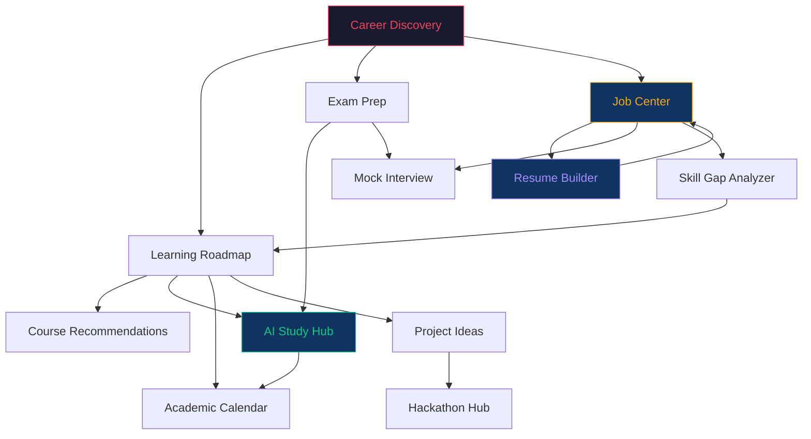

# 🚀 Career Pilot v2.0 — Comprehensive Enhancement Roadmap

> **Team FinessBaba | Brainware AI Hackathon 2026**
>
> *This document details 10 major feature enhancements — 6 from your original ideas (refined and expanded) plus 4 additional suggestions based on product-market fit analysis for Indian students.*

---

## 📋 Table of Contents

| # | Enhancement | Origin | Priority | Effort |
|---|------------|--------|----------|--------|
| 1 | [Unified AI Hub (Tutor + PDF Merge)](#1--unified-ai-hub--merge-tutor--pdf-assistant) | Your Idea #1 | 🔴 Critical | Medium |
| 2 | [Academic Calendar & Semester Planner](#2--academic-calendar--semester-planner) | Your Idea #2 | 🔴 Critical | High |
| 3 | [Competitive Exam Preparation Center](#3--competitive-exam-preparation-center) | Your Idea #3 | 🟡 High | High |
| 4 | [Resume Builder & ATS Analyzer](#4--resume-builder--ats-analyzer) | Your Idea #4 | 🔴 Critical | High |
| 5 | [Projects & Hackathon Hub](#5--projects--hackathon-hub) | Your Idea #5 | 🟢 Medium | Medium |
| 6 | [Internship & Job Center](#6--internship--job-center) | Your Idea #6 | 🔴 Critical | High |
| 7 | [AI Mock Interview Suite](#7--ai-mock-interview-suite) | New Suggestion | 🟡 High | High |
| 8 | [Gamification & Achievement System](#8--gamification--achievement-system) | New Suggestion | 🟢 Medium | Medium |
| 9 | [AI Skill Gap Analyzer & Portfolio Tracker](#9--ai-skill-gap-analyzer--portfolio-tracker) | New Suggestion | 🟡 High | Medium |
| 10 | [Multi-language & Accessibility](#10--multi-language--accessibility) | New Suggestion | 🟢 Medium | Medium |

---

## 1. 🧠 Unified AI Hub — Merge Tutor + PDF Assistant

### Problem
Currently, the AI Tutor (`/tutor`) and AI PDF Assistant (`/pdf`) are separate pages with isolated contexts. A student uploading notes in PDF cannot seamlessly ask follow-up questions about them in the tutor — they have to manually copy-paste. This creates friction and breaks the learning flow.

### Vision
Create a **single, unified AI workspace** where the tutor is context-aware of all uploaded documents. Think of it as "ChatGPT meets Notion" — one intelligent interface that can:
- Chat freely (tutor mode)
- Accept document uploads mid-conversation
- Reference uploaded content in answers
- Generate summaries, quizzes, and flashcards — all within the same thread

### Feature Breakdown

| Feature | Description |
|---------|-------------|
| **Unified Chat Interface** | Single chat page with document-aware AI responses |
| **In-Chat Document Upload** | Drag-and-drop PDFs directly into the conversation |
| **Context Switching** | Toggle between "General Tutor" and "Document Q&A" modes |
| **Document Library Sidebar** | Persistent sidebar showing all uploaded docs, clickable to set context |
| **Smart Suggestions** | After upload, AI auto-suggests: "Summarize?", "Generate quiz?", "Explain Chapter 3?" |
| **Thread System** | Multiple conversation threads (e.g., "Math Notes", "DSA Prep", "General") |

### Technical Implementation

#### Step 1: Merge Database Models

Update `ChatHistory` model to support document context:

```typescript
// models/ChatHistory.ts — Updated
const ChatHistorySchema = new mongoose.Schema({
  userId:      { type: Schema.Types.ObjectId, ref: 'User', required: true },
  threadId:    { type: String, required: true, default: () => nanoid() },
  threadTitle: { type: String, default: 'New Conversation' },
  threadType:  { type: String, enum: ['general', 'document', 'quiz'], default: 'general' },
  documentIds: [{ type: Schema.Types.ObjectId, ref: 'Document' }], // linked docs
  messages: [{
    role:       { type: String, enum: ['user', 'assistant', 'system'], required: true },
    content:    { type: String, required: true },
    attachments: [{
      type:     { type: String, enum: ['pdf', 'image', 'code'] },
      filename: String,
      docId:    { type: Schema.Types.ObjectId, ref: 'Document' },
    }],
    metadata: {
      generatedQuiz: Boolean,
      generatedSummary: Boolean,
      tokensUsed: Number,
    },
    sentAt: { type: Date, default: Date.now },
  }],
  isPinned: { type: Boolean, default: false },
}, { timestamps: true });
```

#### Step 2: Unified API Route

```
app/api/ai-hub/
├── chat/route.ts           # POST: Send message (with optional doc context)
├── threads/route.ts        # GET: List threads | POST: Create thread
├── threads/[id]/route.ts   # GET/PUT/DELETE thread
├── upload/route.ts         # POST: Upload doc within conversation context
└── suggest/route.ts        # POST: Get AI-suggested actions for a document
```

**Key endpoint — `/api/ai-hub/chat/route.ts`:**
1. Receive user message + optional `documentIds[]` + `threadId`
2. If documents are attached, fetch their extracted text from `Document` collection
3. Build system prompt with document context injected
4. Call OpenAI with conversation history + document context
5. Detect intent (is user asking for summary? quiz? explanation?)
6. If quiz/summary requested, generate and return structured data alongside chat response
7. Save to `ChatHistory` with thread association

#### Step 3: Frontend Components

```
components/ai-hub/
├── AIHubLayout.tsx          # Three-panel layout (threads | chat | context)
├── ThreadList.tsx           # Left sidebar — conversation threads
├── UnifiedChat.tsx          # Main chat area with rich message support
├── MessageBubble.tsx        # Enhanced — supports attachments, quizzes inline
├── DocumentContext.tsx      # Right sidebar — active document viewer
├── InlineQuizCard.tsx       # Quiz rendered directly in chat
├── InlineSummaryCard.tsx    # Summary rendered directly in chat
├── QuickActionBar.tsx       # "Summarize" / "Quiz Me" / "Explain" buttons
└── UploadDropzone.tsx       # Drag-drop zone that appears in chat input
```

#### Step 4: Page & Navigation Update

```typescript
// app/(dashboard)/ai-hub/page.tsx — New unified page
// Replaces both /tutor and /pdf

// Sidebar update:
// REMOVE: { name: "AI PDF Assistant", href: "/pdf", icon: "picture_as_pdf" }
// REMOVE: { name: "AI Tutor", href: "/tutor", icon: "psychology" }
// ADD:    { name: "AI Study Hub", href: "/ai-hub", icon: "auto_awesome" }
```

#### Step 5: Migration

- Keep `/pdf` and `/tutor` routes as redirects to `/ai-hub` for backward compatibility
- Migrate existing `ChatHistory` and `Document` data into the new thread-based model
- Write a one-time migration script in `scripts/migrate-ai-hub.ts`

### UX Wireframe Description

```
┌──────────────┬─────────────────────────────────┬──────────────┐
│   THREADS    │         CHAT AREA               │  DOC CONTEXT │
│              │                                  │              │
│ 📝 DSA Prep  │  [System] I've loaded your PDF   │ 📄 DSA.pdf   │
│ 📄 ML Notes  │  "Data Structures Chapter 3"     │              │
│ 💬 General   │                                  │ Pages: 42    │
│              │  [You] Explain binary trees       │ Extracted: ✓ │
│              │                                  │              │
│              │  [AI] A binary tree is a          │ ── Actions ──│
│              │  hierarchical data structure...   │ Summarize    │
│              │                                  │ Quiz Me      │
│              │  ┌─────────────────────────┐     │ Flashcards   │
│              │  │ 🎯 Quick Quiz Generated │     │              │
│              │  │ Q1: What is the height  │     │              │
│              │  │ of a balanced BST...    │     │              │
│              │  └─────────────────────────┘     │              │
│              │                                  │              │
│  + New Thread│  [📎 Drop PDF] Type message...    │              │
└──────────────┴─────────────────────────────────┴──────────────┘
```

---

## 2. 📅 Academic Calendar & Semester Planner

### Problem
Students often don't plan their semester strategically. They cram before exams, skip revision, and have no structured timeline. Most existing tools (Google Calendar, Notion) require manual setup and don't understand academic context.

### Vision
An AI-powered semester planner that takes a **syllabus PDF + semester dates** and automatically generates a **week-by-week study plan** with milestones, revision periods, and exam prep blocks. Think "AI Academic Project Manager."

### Feature Breakdown

| Feature | Description |
|---------|-------------|
| **Syllabus Upload & Parsing** | Upload syllabus PDF → AI extracts subjects, topics, credit hours |
| **Semester Configuration** | Set start date, end date, exam dates, holidays |
| **AI Study Plan Generation** | Generate week-by-week plan with topic scheduling |
| **Interactive Calendar View** | Visual calendar with color-coded subject blocks |
| **Gantt Chart / Timeline View** | Horizontal timeline showing parallel subject progress |
| **Smart Rescheduling** | If user falls behind, AI reshuffles remaining weeks |
| **Daily Task Breakdown** | Each week breaks into daily study goals |
| **Integration with Study With Me** | Auto-populate daily todos from the planner |
| **Exam Countdown** | Countdown timers for upcoming exams |
| **Progress Heatmap** | GitHub-style heatmap showing study consistency |

### Technical Implementation

#### Step 1: New Database Models

```typescript
// models/Semester.ts
const SemesterSchema = new mongoose.Schema({
  userId:     { type: Schema.Types.ObjectId, ref: 'User', required: true },
  name:       { type: String, required: true }, // "BCA Sem 5", "MCA Sem 2"
  startDate:  { type: Date, required: true },
  endDate:    { type: Date, required: true },
  examStartDate: { type: Date },
  examEndDate:   { type: Date },
  holidays:   [{ date: Date, name: String }],
  subjects:   [{
    name:         String,
    code:         String,
    credits:      Number,
    type:         { type: String, enum: ['theory', 'practical', 'elective'] },
    modules:      [{
      name:       String,
      topics:     [String],
      estimatedHours: Number,
      priority:   { type: String, enum: ['high', 'medium', 'low'] },
    }],
    examDate:     Date,
    internalDates: [Date],
  }],
  syllabusDocId: { type: Schema.Types.ObjectId, ref: 'Document' },
  status:     { type: String, enum: ['active', 'completed', 'archived'], default: 'active' },
}, { timestamps: true });

// models/StudyPlan.ts
const StudyPlanSchema = new mongoose.Schema({
  userId:      { type: Schema.Types.ObjectId, ref: 'User', required: true },
  semesterId:  { type: Schema.Types.ObjectId, ref: 'Semester', required: true },
  weeks: [{
    weekNumber:  Number,
    startDate:   Date,
    endDate:     Date,
    phase:       { type: String, enum: ['learning', 'revision', 'exam-prep', 'exam', 'break'] },
    dailyPlans:  [{
      date:      Date,
      tasks:     [{
        subject:   String,
        topic:     String,
        type:      { type: String, enum: ['study', 'practice', 'revision', 'assignment', 'internal'] },
        duration:  Number, // minutes
        completed: { type: Boolean, default: false },
        completedAt: Date,
      }],
    }],
  }],
  generatedAt:  Date,
  regeneratedCount: { type: Number, default: 0 },
}, { timestamps: true });
```

#### Step 2: API Routes

```
app/api/calendar/
├── semester/
│   ├── route.ts                 # GET: List semesters | POST: Create semester
│   └── [id]/
│       ├── route.ts             # GET/PUT/DELETE semester
│       └── generate-plan/route.ts  # POST: AI generates study plan
├── plan/
│   ├── route.ts                 # GET: Current active plan
│   ├── [weekId]/route.ts        # PUT: Update week/day progress
│   └── reschedule/route.ts      # POST: AI reschedules remaining plan
├── syllabus/
│   └── parse/route.ts           # POST: Upload & parse syllabus PDF
└── stats/
    └── route.ts                 # GET: Completion stats, heatmap data
```

**Key endpoint — `/api/calendar/semester/[id]/generate-plan/route.ts`:**
1. Fetch semester data (subjects, modules, dates, holidays)
2. Calculate total available study days (minus holidays, Sundays, exam days)
3. Construct prompt for AI with:
   - All subjects and their topic trees
   - Credit weights (more credits = more study time)
   - Exam dates (schedule revision blocks before each exam)
   - Internal test dates (allocate prep time)
4. AI returns a structured week-by-week JSON plan
5. Post-process: validate no overlapping exam-prep windows, ensure revision gaps
6. Save to `StudyPlan` collection
7. Optionally sync daily tasks to `Todo` model (Study With Me integration)

#### Step 3: Frontend Components

```
components/calendar/
├── SemesterSetup.tsx          # Multi-step form: dates → subjects → upload syllabus
├── SyllabusParsed.tsx         # Review AI-parsed syllabus (editable)
├── CalendarView.tsx           # Monthly calendar with color-coded blocks
├── TimelineView.tsx           # Gantt-style horizontal timeline
├── WeeklyBreakdown.tsx        # Detailed daily task list for selected week
├── PlanProgressBar.tsx        # Overall semester completion percentage
├── ExamCountdown.tsx          # Countdown timers for upcoming exams
├── RescheduleModal.tsx        # "I fell behind" → AI reshuffles
├── HeatmapView.tsx            # GitHub-style study consistency heatmap
└── SubjectDistribution.tsx    # Pie/bar chart of time allocated per subject
```

#### Step 4: Page Structure

```
app/(dashboard)/calendar/
├── page.tsx                   # Main calendar view (or setup wizard if no semester)
├── setup/page.tsx             # Semester setup wizard
└── plan/[weekId]/page.tsx     # Detailed weekly view
```

#### Step 5: AI Prompt Engineering

The plan generation prompt should follow this structure:

```
You are an academic planner AI. Given the following semester details, generate
a comprehensive week-by-week study plan.

SEMESTER: {name}, {startDate} to {endDate}
SUBJECTS: [{name, credits, modules: [{name, topics, estimatedHours}], examDate}]
HOLIDAYS: [{date, name}]
CONSTRAINTS:
- No study on holidays or Sundays (unless exam is within 3 days)
- Allocate 1 revision week before each subject exam
- Higher credit subjects get proportionally more daily time
- Distribute subjects across days (don't study 1 subject all day)
- Include short break periods between subjects
- Phase structure: Learning → Revision → Exam Prep → Exam

OUTPUT FORMAT: JSON array of weeks with daily breakdowns...
```

### UX Wireframe Description

```
┌──────────────────────────────────────────────────────────────┐
│  📅 ACADEMIC CALENDAR — BCA Semester 5                       │
│  Jan 15 – Jun 30, 2027  |  Exams: May 15 – Jun 10           │
├──────────────────────────────────────────────────────────────┤
│                                                              │
│  [Calendar View]  [Timeline View]  [Weekly View]             │
│                                                              │
│  ┌─── FEBRUARY 2027 ──────────────────────────────────────┐  │
│  │ Mon  Tue  Wed  Thu  Fri  Sat  Sun                      │  │
│  │  3    4    5    6    7    8    9                        │  │
│  │ 🔵   🟢   🔵   🟣   🟢   🔵   ─                        │  │
│  │ DSA  OS   DSA  DBMS OS   DSA                           │  │
│  │                                                        │  │
│  │  10   11   12   13   14   15   16                      │  │
│  │ 🟣   🔵   🟣   🟢   🔵   ⚠️   ─                        │  │
│  │ DBMS DSA  DBMS OS   DSA  INT                           │  │
│  └────────────────────────────────────────────────────────┘  │
│                                                              │
│  ── UPCOMING ──────────────────────                          │
│  🔴 Internal Test: DSA — in 8 days                           │
│  🟡 Assignment Due: OS Lab — in 12 days                      │
│  📅 Mid-Sem Exam — in 45 days                                │
│                                                              │
│  ── TODAY'S PLAN ──────────────                              │
│  ☐ 9:00–10:30 — DSA: Binary Trees (Chapter 5)               │
│  ☐ 11:00–12:00 — OS: Process Scheduling                     │
│  ☐ 14:00–15:30 — DSA: Practice Problems                     │
│  ☐ 16:00–17:00 — DBMS: Normalization Review                 │
└──────────────────────────────────────────────────────────────┘
```

---

## 3. 🎯 Competitive Exam Preparation Center

### Problem
Indian students preparing for competitive exams (GATE, CUET PG, CAT, GMAT, GRE, UGC-NET) lack a centralized resource that combines syllabus tracking, topic-wise preparation, mock tests, and previous year question analysis.

### Design Decision: Separate Section vs. Career Module

> [!IMPORTANT]
> **Recommendation: Keep it as a SEPARATE section**, not inside Career Discovery.
>
> **Rationale:**
> - Exam prep is a **standalone goal** — many users will come specifically for this, not for career discovery
> - The content structure is fundamentally different (syllabus-driven, not interest-driven)
> - It has its own user journey (select exam → track syllabus → practice → mock tests)
> - However, link it FROM career discovery: "Your career path suggests GATE CS — [Start Prep →]"
> - This becomes a **major differentiator** — no competing hackathon project will have this

### Feature Breakdown

| Feature | Description |
|---------|-------------|
| **Exam Selection** | Choose from GATE (CS/IT/DA), CUET PG, CAT, GMAT, GRE, UGC-NET |
| **Syllabus Tracker** | Official syllabus broken into topics with completion tracking |
| **Topic-wise Study Material** | AI-curated resources (videos, notes, books) per topic |
| **AI Question Generator** | Generate practice questions by topic and difficulty |
| **Previous Year Papers** | Curated PYQ links with topic tags |
| **Mock Test Engine** | Timed mock tests with auto-grading and analysis |
| **Performance Analytics** | Topic-wise accuracy, time analysis, weak area identification |
| **Study Schedule Generator** | AI creates daily prep schedule based on exam date & progress |
| **Cross-link to Career** | "Why this exam?" context from career path |

### Technical Implementation

#### Step 1: Database Models

```typescript
// models/ExamPrep.ts
const ExamSchema = new mongoose.Schema({
  code:        { type: String, required: true, unique: true }, // 'GATE_CS', 'CAT', etc.
  name:        { type: String, required: true },
  fullName:    { type: String },
  category:    { type: String, enum: ['engineering', 'management', 'general', 'academic'] },
  description: String,
  eligibility: String,
  examPattern: {
    totalMarks:   Number,
    duration:     Number, // minutes
    sections:     [{ name: String, marks: Number, questions: Number }],
    negativeMarking: Boolean,
    negativeMarkValue: Number,
  },
  syllabus:    [{
    section:  String,
    topics:   [{
      name:       String,
      subtopics:  [String],
      weightage:  { type: String, enum: ['high', 'medium', 'low'] },
      avgQuestions: Number, // average questions in recent papers
    }],
  }],
  officialUrl:  String,
  examDates:    [{ year: Number, date: Date, registrationDeadline: Date }],
});

// models/UserExamPrep.ts
const UserExamPrepSchema = new mongoose.Schema({
  userId:    { type: Schema.Types.ObjectId, ref: 'User', required: true },
  examCode:  { type: String, required: true },
  targetDate: Date,
  topicProgress: [{
    topicName:    String,
    section:      String,
    status:       { type: String, enum: ['not-started', 'in-progress', 'revision', 'mastered'] },
    practiceCount: { type: Number, default: 0 },
    accuracy:     Number, // percentage
    lastPracticed: Date,
  }],
  mockTestHistory: [{
    testId:     String,
    score:      Number,
    totalMarks: Number,
    timeTaken:  Number,
    date:       Date,
    sectionWise: [{ section: String, score: Number, total: Number }],
  }],
  studyStreak:   { type: Number, default: 0 },
}, { timestamps: true });

// models/MockTest.ts
const MockTestSchema = new mongoose.Schema({
  examCode:   { type: String, required: true },
  title:      String,
  type:       { type: String, enum: ['full', 'sectional', 'topic'] },
  section:    String,
  topic:      String,
  difficulty: { type: String, enum: ['easy', 'medium', 'hard'] },
  questions:  [{
    question:    String,
    options:     [String],
    answer:      Number, // index of correct option
    explanation: String,
    topic:       String,
    difficulty:  String,
    marks:       Number,
    negativeMarks: Number,
  }],
  duration:   Number, // minutes
  isAIGenerated: { type: Boolean, default: false },
}, { timestamps: true });
```

#### Step 2: API Routes

```
app/api/exam-prep/
├── exams/
│   ├── route.ts                    # GET: List available exams
│   └── [code]/
│       ├── route.ts                # GET: Exam details + syllabus
│       └── syllabus/route.ts       # GET: Detailed syllabus with weightage
├── user-prep/
│   ├── route.ts                    # GET: User's active preps | POST: Start prep
│   ├── [examCode]/
│   │   ├── route.ts               # GET: User's progress for this exam
│   │   ├── progress/route.ts      # PUT: Update topic progress
│   │   └── schedule/route.ts      # POST: AI generates study schedule
├── mock-test/
│   ├── route.ts                    # GET: Available tests | POST: AI-generate test
│   ├── [testId]/route.ts          # GET: Test questions (timed)
│   └── [testId]/submit/route.ts   # POST: Submit & grade test
├── practice/
│   └── generate/route.ts          # POST: AI generates topic-specific questions
└── analytics/
    └── route.ts                    # GET: Performance analytics
```

#### Step 3: Frontend Components

```
components/exam-prep/
├── ExamSelector.tsx            # Card grid of available exams
├── ExamDashboard.tsx           # Overview: progress, streak, upcoming test
├── SyllabusTracker.tsx         # Expandable tree with checkmarks
├── TopicResources.tsx          # AI-curated study material for a topic
├── MockTestRunner.tsx          # Full-screen timed test interface
├── TestResults.tsx             # Score analysis with charts
├── PerformanceChart.tsx        # Topic-wise accuracy radar chart
├── WeakAreaCards.tsx           # AI-identified weak topics with action items
├── PYQBrowser.tsx              # Previous year questions by topic
└── PrepScheduleView.tsx        # AI-generated daily prep schedule
```

#### Step 4: Page Structure

```
app/(dashboard)/exam-prep/
├── page.tsx                    # Exam selection / active prep dashboard
├── [examCode]/
│   ├── page.tsx                # Exam-specific dashboard
│   ├── syllabus/page.tsx       # Syllabus tracker
│   ├── practice/page.tsx       # Topic practice
│   └── mock-test/
│       ├── page.tsx            # Test list / start new test
│       └── [testId]/page.tsx   # Active test runner
```

#### Step 5: Seed Data

Create seed data for at least 3 exams with full syllabi:
- **GATE CS** — Complete syllabus with topic weightage from last 5 years
- **CUET PG (Computer Science)** — Full syllabus with sections
- **CAT** — Quantitative, Verbal, DILR sections

```
scripts/seed-exams.ts   # Seed script with real syllabus data
```

---

## 4. 📝 Resume Builder & ATS Analyzer

### Problem
Most students create resumes using generic templates without understanding ATS (Applicant Tracking System) compatibility. They don't know what keywords to use, how to structure bullet points, or how their resume performs against actual job descriptions.

### Feature Breakdown

| Feature | Description |
|---------|-------------|
| **Resume Builder** | Structured form → generates formatted resume (multiple templates) |
| **Template Gallery** | 5-8 professional templates (Modern, Classic, Tech, Creative, etc.) |
| **AI Content Suggestions** | AI suggests bullet points based on experience description |
| **ATS Score Analyzer** | Upload resume → get ATS compatibility score with breakdown |
| **Job Description Matching** | Paste JD → get keyword match analysis + missing skills |
| **AI Resume Review** | Detailed AI feedback on content, formatting, impact |
| **Export Options** | Download as PDF, DOCX |
| **Version History** | Save multiple versions (v1: SDE, v2: Data Science, etc.) |
| **LinkedIn-to-Resume** | Import from LinkedIn profile (stretch goal) |

### Technical Implementation

#### Step 1: Database Models

```typescript
// models/Resume.ts
const ResumeSchema = new mongoose.Schema({
  userId:    { type: Schema.Types.ObjectId, ref: 'User', required: true },
  title:     { type: String, default: 'My Resume' },
  template:  { type: String, default: 'modern' },
  version:   { type: Number, default: 1 },
  isActive:  { type: Boolean, default: true },
  content: {
    personalInfo: {
      fullName:  String,
      email:     String,
      phone:     String,
      location:  String,
      linkedin:  String,
      github:    String,
      portfolio: String,
      summary:   String, // professional summary
    },
    education: [{
      institution: String,
      degree:      String,
      field:       String,
      startDate:   Date,
      endDate:     Date,
      gpa:         String,
      achievements: [String],
    }],
    experience: [{
      company:     String,
      title:       String,
      location:    String,
      startDate:   Date,
      endDate:     Date,
      current:     Boolean,
      bullets:     [String],
      technologies: [String],
    }],
    projects: [{
      name:        String,
      description: String,
      technologies: [String],
      url:         String,
      github:      String,
      bullets:     [String],
    }],
    skills: {
      technical:   [String],
      frameworks:  [String],
      tools:       [String],
      soft:        [String],
    },
    certifications: [{
      name:     String,
      issuer:   String,
      date:     Date,
      url:      String,
    }],
    customSections: [{
      title:   String,
      items:   [{ text: String, subtext: String }],
    }],
  },
  atsAnalysis: {
    score:         Number,
    keywordDensity: Number,
    formatting:    Number,
    readability:   Number,
    suggestions:   [String],
    analyzedAt:    Date,
  },
}, { timestamps: true });
```

#### Step 2: API Routes

```
app/api/resume/
├── route.ts                    # GET: List resumes | POST: Create new
├── [id]/
│   ├── route.ts                # GET/PUT/DELETE resume
│   ├── export/route.ts         # POST: Generate PDF/DOCX
│   └── analyze/route.ts        # POST: ATS analysis
├── templates/route.ts          # GET: Available templates
├── ai/
│   ├── suggest-bullets/route.ts  # POST: AI bullet point suggestions
│   ├── review/route.ts          # POST: Full AI resume review
│   └── match-jd/route.ts        # POST: Match resume against job description
└── upload-existing/route.ts    # POST: Upload existing resume PDF for analysis
```

**Key endpoint — `/api/resume/[id]/analyze/route.ts`:**
1. Fetch resume content from database
2. Build analysis prompt covering:
   - **ATS Compatibility**: Check for parseable text, proper section headers, no tables/images
   - **Keyword Density**: Identify industry-standard keywords present/missing
   - **Impact Metrics**: Check for quantified achievements ("Increased X by 30%")
   - **Formatting Score**: Header hierarchy, bullet consistency, length
   - **Readability**: Sentence structure, action verbs usage
3. Return structured analysis with overall score (0-100) and section-wise breakdown

#### Step 3: Frontend Components

```
components/resume/
├── ResumeBuilder.tsx           # Main builder with sections
├── ResumePreview.tsx           # Live preview of the resume
├── TemplateSelector.tsx        # Visual template picker
├── SectionEditor.tsx           # Generic section editor (education, experience, etc.)
├── BulletEditor.tsx            # Rich bullet point editor with AI suggestions
├── ATSScoreCard.tsx            # Visual score display with breakdown
├── JDMatcher.tsx               # Job description paste + analysis results
├── AIReviewPanel.tsx           # Full AI feedback display
├── ExportDialog.tsx            # Export format selection + download
└── VersionHistory.tsx          # List of saved versions
```

#### Step 4: Page Structure

```
app/(dashboard)/resume/
├── page.tsx                    # Resume list + create new
├── builder/[id]/page.tsx       # Full builder interface
├── preview/[id]/page.tsx       # Full-screen preview
└── analyze/page.tsx            # Upload & analyze existing resume
```

#### Step 5: Resume PDF Generation

Use **@react-pdf/renderer** or **puppeteer** (server-side) for PDF generation:

```bash
npm install @react-pdf/renderer
```

Create template components in `components/resume/templates/`:
- `ModernTemplate.tsx`
- `ClassicTemplate.tsx`
- `TechTemplate.tsx`
- `MinimalTemplate.tsx`
- `CreativeTemplate.tsx`

---

## 5. 🏗️ Projects & Hackathon Hub

### My Opinion on Your Idea #5

> [!TIP]
> **This is a GREAT idea** — here's why it works for Career Pilot:
>
> 1. **Natural extension**: Your career roadmap already suggests projects → this gives them a place to live
> 2. **Hackathon discovery** is a genuine pain point for Indian students — there's no single aggregator
> 3. **Community features are the right long-term play** — but start small for the hackathon MVP
> 4. **Differentiator**: No competing project will have this
>
> **My recommendation for scope:**
> - ✅ **Phase 1 (Hackathon MVP)**: Project ideas gallery + Hackathon listings + team formation
> - 🔜 **Phase 2 (Post-hackathon)**: Full community with discussions, mentorship, team matching
> - 🔜 **Phase 3 (Future)**: Project showcase/portfolio, peer review, upvoting

### Feature Breakdown

| Feature | Description | Phase |
|---------|-------------|-------|
| **Project Ideas Gallery** | AI-curated project ideas by career path, difficulty, tech stack | Phase 1 |
| **Hackathon Listings** | Aggregated upcoming hackathons (Devfolio, MLH, Unstop, etc.) | Phase 1 |
| **Team Formation** | "Looking for team" posts with skills/interests matching | Phase 1 |
| **Project Showcase** | Users share completed projects with links, screenshots | Phase 2 |
| **Discussion Threads** | Topic-based discussions (Q&A, resources, experiences) | Phase 2 |
| **Mentorship Matching** | Senior students/alumni matched with juniors | Phase 3 |
| **Community Challenges** | Weekly/monthly coding challenges | Phase 3 |

### Technical Implementation (Phase 1 — Hackathon MVP)

#### Step 1: Database Models

```typescript
// models/ProjectIdea.ts
const ProjectIdeaSchema = new mongoose.Schema({
  title:         { type: String, required: true },
  description:   String,
  difficulty:    { type: String, enum: ['beginner', 'intermediate', 'advanced'] },
  careerPaths:   [String],
  technologies:  [String],
  estimatedTime: String, // "2-3 weeks", "1 month"
  features:      [String],
  resources:     [{ title: String, url: String, type: String }],
  isAIGenerated: { type: Boolean, default: false },
  upvotes:       { type: Number, default: 0 },
}, { timestamps: true });

// models/Hackathon.ts
const HackathonSchema = new mongoose.Schema({
  title:        { type: String, required: true },
  organizer:    String,
  platform:     { type: String, enum: ['devfolio', 'mlh', 'unstop', 'hackerearth', 'other'] },
  url:          { type: String, required: true },
  description:  String,
  startDate:    Date,
  endDate:      Date,
  registrationDeadline: Date,
  mode:         { type: String, enum: ['online', 'offline', 'hybrid'] },
  location:     String,
  prizes:       String,
  themes:       [String],
  skillLevel:   { type: String, enum: ['beginner-friendly', 'intermediate', 'advanced', 'all'] },
  isFeatured:   { type: Boolean, default: false },
  status:       { type: String, enum: ['upcoming', 'active', 'completed'] },
}, { timestamps: true });

// models/TeamPost.ts
const TeamPostSchema = new mongoose.Schema({
  userId:       { type: Schema.Types.ObjectId, ref: 'User', required: true },
  hackathonId:  { type: Schema.Types.ObjectId, ref: 'Hackathon' },
  title:        String,
  description:  String,
  lookingFor:   [String], // skills needed: "React", "ML", "UI/UX"
  teamSize:     Number,
  currentMembers: Number,
  status:       { type: String, enum: ['open', 'closed'], default: 'open' },
  contactMethod: String, // Discord, email, etc.
}, { timestamps: true });
```

#### Step 2: API Routes

```
app/api/projects/
├── ideas/
│   ├── route.ts                  # GET: Browse ideas | POST: AI-generate ideas
│   └── [id]/route.ts             # GET: Idea details
├── hackathons/
│   ├── route.ts                  # GET: List hackathons (with filters)
│   ├── [id]/route.ts             # GET: Hackathon details
│   └── featured/route.ts         # GET: Featured/upcoming hackathons
├── teams/
│   ├── route.ts                  # GET: Team posts | POST: Create team post
│   └── [id]/route.ts             # GET/PUT/DELETE team post
└── generate/route.ts             # POST: AI generates project ideas for user's career path
```

#### Step 3: Frontend Components

```
components/projects/
├── ProjectIdeaCard.tsx         # Card showing project idea with tech stack tags
├── ProjectIdeaGrid.tsx         # Filterable grid of project ideas
├── HackathonCard.tsx           # Card with hackathon details + countdown
├── HackathonCalendar.tsx       # Calendar view of upcoming hackathons
├── TeamPostCard.tsx            # "Looking for team" post
├── TeamPostForm.tsx            # Form to create team post
├── FiltersBar.tsx              # Difficulty, tech stack, career path filters
└── AIProjectGenerator.tsx      # "Generate project ideas for me" button + results
```

#### Step 4: Page Structure

```
app/(dashboard)/projects/
├── page.tsx                    # Main hub with tabs: Ideas | Hackathons | Teams
├── ideas/[id]/page.tsx         # Project idea detail page
└── hackathons/[id]/page.tsx    # Hackathon detail page
```

#### Step 5: Hackathon Data Sourcing

For the MVP, seed hackathon data manually. Post-hackathon, build scrapers:

```typescript
// lib/hackathonSources.ts — Future scraper targets
const SOURCES = [
  { name: 'Devfolio', url: 'https://devfolio.co/hackathons', method: 'API' },
  { name: 'Unstop', url: 'https://unstop.com/hackathons', method: 'scrape' },
  { name: 'MLH', url: 'https://mlh.io/seasons/2027/events', method: 'API' },
  { name: 'HackerEarth', url: 'https://www.hackerearth.com/challenges/', method: 'API' },
];
```

---

## 6. 💼 Internship & Job Center

### Problem
Students waste hours scrolling LinkedIn, Internshala, and Naukri without structured preparation. They don't know which roles match their skill level, how to prepare for specific company interviews, or what skills are currently in-demand.

### Feature Breakdown

| Feature | Description |
|---------|-------------|
| **Job/Internship Feed** | Curated listings from multiple sources, filtered by user's career path |
| **Application Tracker** | Kanban board: Saved → Applied → Interview → Offer → Rejected |
| **Company Research** | AI-generated company profiles with interview tips |
| **Skill-to-Role Mapping** | "Based on your skills, you're ready for: [Junior SDE, ML Intern]" |
| **Preparation Resources** | Topic-wise prep for specific roles (DSA for SDE, Stats for DS) |
| **Salary Insights** | Typical salary ranges for roles at different levels |
| **Alert System** | Email/push notifications for matching new listings |
| **Interview Experiences** | Crowdsourced/AI-summarized interview experiences by company |

### Technical Implementation

#### Step 1: Database Models

```typescript
// models/JobListing.ts
const JobListingSchema = new mongoose.Schema({
  title:        { type: String, required: true },
  company:      { type: String, required: true },
  companyLogo:  String,
  type:         { type: String, enum: ['internship', 'full-time', 'part-time', 'contract'] },
  location:     String,
  remote:       { type: Boolean, default: false },
  salary:       { min: Number, max: Number, currency: String, period: String },
  description:  String,
  requirements: [String],
  skills:       [String],
  experienceLevel: { type: String, enum: ['fresher', 'junior', 'mid', 'senior'] },
  careerPaths:  [String],
  applyUrl:     String,
  source:       { type: String, enum: ['internshala', 'linkedin', 'naukri', 'manual', 'scraped'] },
  postedDate:   Date,
  deadline:     Date,
  isActive:     { type: Boolean, default: true },
}, { timestamps: true });

// models/Application.ts
const ApplicationSchema = new mongoose.Schema({
  userId:      { type: Schema.Types.ObjectId, ref: 'User', required: true },
  jobId:       { type: Schema.Types.ObjectId, ref: 'JobListing' },
  customJob:   { title: String, company: String, url: String }, // for manual entries
  status:      { type: String, enum: ['saved', 'applied', 'screening', 'interview', 'offer', 'rejected', 'withdrawn'], default: 'saved' },
  appliedDate: Date,
  notes:       String,
  nextAction:  { action: String, date: Date },
  resumeId:    { type: Schema.Types.ObjectId, ref: 'Resume' },
  timeline:    [{
    status: String,
    date:   Date,
    note:   String,
  }],
}, { timestamps: true });
```

#### Step 2: API Routes

```
app/api/jobs/
├── listings/
│   ├── route.ts                    # GET: Filtered listings
│   └── [id]/route.ts              # GET: Listing details
├── applications/
│   ├── route.ts                    # GET: User's applications | POST: Create
│   ├── [id]/route.ts              # PUT: Update status | DELETE
│   └── stats/route.ts             # GET: Application statistics
├── companies/
│   ├── [name]/route.ts            # GET: AI company profile
│   └── [name]/interview/route.ts  # GET: Interview tips for company
├── match/route.ts                  # GET: AI-matched jobs based on user profile
├── prep/
│   └── [roleType]/route.ts        # GET: Preparation resources for a role
└── news/
    └── route.ts                    # GET: Job market news & trends
```

#### Step 3: Frontend Components

```
components/jobs/
├── JobListingCard.tsx          # Job card with company, location, skills
├── JobListingGrid.tsx          # Filterable listings grid
├── ApplicationKanban.tsx       # Drag-and-drop Kanban board
├── ApplicationCard.tsx         # Card within Kanban column
├── CompanyProfile.tsx          # AI-generated company research
├── SkillMatchIndicator.tsx     # Visual skill match percentage
├── PrepChecklist.tsx           # Role-specific preparation checklist
├── SalaryInsight.tsx           # Salary range visualization
├── JobAlertSetup.tsx           # Alert preferences form
├── MarketTrends.tsx            # In-demand skills & hiring trends
└── InterviewExperience.tsx     # Interview experience cards
```

#### Step 4: Page Structure

```
app/(dashboard)/jobs/
├── page.tsx                    # Main job center (listings + market trends)
├── tracker/page.tsx            # Application tracker (Kanban)
├── company/[name]/page.tsx     # Company research page
└── prep/[role]/page.tsx        # Role preparation guide
```

#### Step 5: Integration with Other Modules

This is where Career Pilot's ecosystem becomes powerful:

```
Career Discovery → selects "Full Stack Developer"
      ↓
Roadmap → shows learning path
      ↓
Job Center → shows matching jobs for current roadmap stage
      ↓
Resume Builder → auto-fills skills from roadmap progress
      ↓
Exam Prep → suggests relevant certifications
      ↓
Interview Prep → company-specific preparation
```

---

## 7. 🎤 AI Mock Interview Suite *(New Suggestion)*

### Why This Matters
This is the **#1 feature gap** in Indian EdTech for students. Mock interviews are expensive (₹500-2000/session), and most students have zero interview practice before their first real interview. An AI interviewer that adapts to the user's career path, provides real-time feedback, and tracks improvement over time would be revolutionary.

### Feature Breakdown

| Feature | Description |
|---------|-------------|
| **Role-Specific Interviews** | AI conducts interviews based on selected career path |
| **Question Types** | Technical, behavioral, HR, case study, system design |
| **Real-Time Feedback** | AI evaluates answers for completeness, clarity, technical accuracy |
| **Follow-Up Questions** | AI asks contextual follow-ups (like a real interviewer) |
| **Performance Report** | Post-interview report with scores, strengths, improvements |
| **Question Bank** | Browse common questions by company and role |
| **Practice Mode** | One question at a time, with hints and model answers |
| **Interview History** | Track improvement across multiple sessions |

### Technical Implementation

#### Step 1: Database Model

```typescript
// models/MockInterview.ts
const MockInterviewSchema = new mongoose.Schema({
  userId:       { type: Schema.Types.ObjectId, ref: 'User', required: true },
  type:         { type: String, enum: ['technical', 'behavioral', 'hr', 'system-design', 'mixed'] },
  role:         String, // "SDE", "Data Scientist", etc.
  company:      String, // optional: "Google", "TCS", etc.
  difficulty:   { type: String, enum: ['easy', 'medium', 'hard'] },
  status:       { type: String, enum: ['in-progress', 'completed', 'abandoned'] },
  conversation: [{
    role:     { type: String, enum: ['interviewer', 'candidate'] },
    content:  String,
    feedback: {
      score:        Number, // 1-10
      strengths:    [String],
      improvements: [String],
    },
    timestamp: Date,
  }],
  overallReport: {
    technicalScore:    Number,
    communicationScore: Number,
    problemSolvingScore: Number,
    confidenceScore:   Number,
    overallScore:      Number,
    detailedFeedback:  String,
    areasToImprove:    [String],
    recommendedTopics: [String],
  },
  duration: Number, // minutes
}, { timestamps: true });
```

#### Step 2: API Routes

```
app/api/interview/
├── start/route.ts              # POST: Start new mock interview
├── respond/route.ts            # POST: Send candidate answer, get AI follow-up
├── end/route.ts                # POST: End interview, generate report
├── history/route.ts            # GET: Past interviews with scores
├── questions/
│   ├── route.ts                # GET: Browse question bank
│   └── [id]/route.ts           # GET: Question with model answer
└── analytics/route.ts          # GET: Improvement trends over time
```

#### Step 3: Frontend Components

```
components/interview/
├── InterviewSetup.tsx          # Configure: role, type, company, difficulty
├── InterviewChat.tsx           # Full-screen interview interface
├── InterviewerAvatar.tsx       # AI interviewer visual representation
├── ResponseInput.tsx           # Text input with timer
├── LiveFeedback.tsx            # Real-time feedback hints (optional)
├── InterviewReport.tsx         # Post-interview analysis dashboard
├── ScoreRadar.tsx              # Radar chart of skill scores
├── QuestionBrowser.tsx         # Searchable question bank
├── ImprovementGraph.tsx        # Score trends across sessions
└── TipCards.tsx                # Interview tips and strategies
```

#### Step 4: Page Structure

```
app/(dashboard)/interview/
├── page.tsx                    # Interview hub (start new + history)
├── session/[id]/page.tsx       # Active interview session
├── report/[id]/page.tsx        # Interview report
└── questions/page.tsx          # Question bank browser
```

---

## 8. 🏆 Gamification & Achievement System *(New Suggestion)*

### Why This Matters
Retention is the biggest challenge for learning platforms. Students sign up, use it once, and forget. Gamification (XP, badges, streaks, leaderboards) creates **daily engagement loops** that keep users coming back.

### Feature Breakdown

| Feature | Description |
|---------|-------------|
| **XP Points** | Earn XP for every action (complete topic, pass quiz, study streak, etc.) |
| **Levels** | Level up as XP accumulates (Level 1: Rookie → Level 50: Career Master) |
| **Badges** | Achievement badges (First Resume, 7-Day Streak, Mock Interview Pro, etc.) |
| **Daily Challenges** | One daily challenge for bonus XP |
| **Weekly Leaderboard** | Anonymous leaderboard showing top learners |
| **Study Streaks** | Consecutive days of activity (already partially exists) |
| **Milestone Rewards** | Unlock features or content at certain milestones |

### Technical Implementation

```typescript
// models/Gamification.ts
const GamificationSchema = new mongoose.Schema({
  userId:    { type: Schema.Types.ObjectId, ref: 'User', required: true, unique: true },
  xp:        { type: Number, default: 0 },
  level:     { type: Number, default: 1 },
  badges:    [{
    badgeId:   String,
    name:      String,
    icon:      String,
    earnedAt:  Date,
    category:  String,
  }],
  streaks: {
    current:    Number,
    longest:    Number,
    lastActive: Date,
  },
  dailyChallenges: [{
    date:       Date,
    challenge:  String,
    completed:  Boolean,
    xpReward:   Number,
  }],
  weeklyXP: [{
    weekStart:  Date,
    xp:         Number,
  }],
});

// XP rewards configuration
const XP_REWARDS = {
  COMPLETE_TOPIC: 50,
  PASS_QUIZ: 30,
  UPLOAD_PDF: 20,
  TUTOR_SESSION: 15,
  DAILY_LOGIN: 10,
  STREAK_BONUS_7: 100,
  STREAK_BONUS_30: 500,
  MOCK_INTERVIEW: 75,
  RESUME_CREATED: 100,
  APPLICATION_SENT: 25,
};
```

This system would be implemented as a **cross-cutting concern** — a middleware/hook that awards XP on various user actions throughout the platform.

---

## 9. 📊 AI Skill Gap Analyzer & Portfolio Tracker *(New Suggestion)*

### Why This Matters
Students don't know what they don't know. An AI-powered skill gap analysis compares their current skills (from assessment, roadmap progress, and completed courses) against market requirements for their target role, and creates a prioritized action plan.

### Feature Breakdown

| Feature | Description |
|---------|-------------|
| **Skill Inventory** | Auto-populated from career assessment, courses, projects |
| **Market Requirements** | AI-analyzed skill requirements from real job postings |
| **Gap Analysis** | Visual comparison: "You have" vs "Market wants" |
| **Priority Ranking** | Skills ranked by: how critical + how far you are from proficiency |
| **Learning Actions** | For each gap, suggest: specific course, project, or practice |
| **Portfolio Score** | Composite score of your market-readiness |
| **Trend Analysis** | "React demand ↑15% this quarter, invest more time here" |

### Technical Implementation

```
app/api/skill-gap/
├── analyze/route.ts            # POST: Run full skill gap analysis
├── market-data/route.ts        # GET: Current market skill demands
├── portfolio-score/route.ts    # GET: User's portfolio/readiness score
└── recommendations/route.ts    # GET: Prioritized learning actions
```

This connects deeply with the Career Discovery, Roadmap, and Job Center modules — making it a powerful integration point.

---

## 10. 🌐 Multi-language & Accessibility *(New Suggestion)*

### Why This Matters
Career Pilot targets Indian students, many of whom are more comfortable in Hindi, Bengali, Tamil, or other regional languages. Accessibility also makes the platform inclusive for differently-abled users.

### Feature Breakdown

| Feature | Description |
|---------|-------------|
| **UI Translation** | Platform interface in Hindi, Bengali, Tamil (Phase 1) |
| **AI Responses in Regional Languages** | Tutor and career advice in user's preferred language |
| **Screen Reader Support** | ARIA labels, semantic HTML, keyboard navigation |
| **High Contrast Mode** | Accessibility color scheme option |
| **Text Size Controls** | User-adjustable font sizes |
| **Voice Input** | Speech-to-text for chat interface |

### Technical Implementation

Use **next-intl** or **next-i18n** for internationalization:
```bash
npm install next-intl
```

Create message files:
```
messages/
├── en.json        # English (default)
├── hi.json        # Hindi
├── bn.json        # Bengali
└── ta.json        # Tamil
```

For AI responses, add language preference to the system prompt:
```
"Respond in {userPreferredLanguage}. Use simple, clear language."
```

---

## 📐 Updated Navigation Structure

With all enhancements, the sidebar should be reorganized into logical groups:

```
── LEARN ──────────────────────
  📊 Dashboard
  🧭 Career Discovery
  🗺️ Learning Roadmap
  📚 Courses
  📅 Academic Calendar          ← NEW

── AI TOOLS ───────────────────
  🧠 AI Study Hub              ← MERGED (Tutor + PDF)
  📝 Resume Builder            ← NEW
  🎤 Mock Interview            ← NEW

── PREPARE ────────────────────
  🎯 Exam Prep                 ← NEW
  💼 Jobs & Internships        ← NEW
  🏗️ Projects & Hackathons     ← NEW

── PERSONAL ───────────────────
  📖 Study With Me
  📰 Tech News
  👤 Profile
```

---

## 🗓️ Implementation Priority & Timeline

### Phase 1 — Hackathon MVP (Now → June 22 Proposal)
Focus on features that create the **most impressive demo**:

| Priority | Feature | Why |
|----------|---------|-----|
| 1 | Unified AI Hub | Merges existing code, demos well |
| 2 | Academic Calendar | Highly visual, solves real pain point |
| 3 | Resume Builder (basic) | Everyone needs a resume, visual output |
| 4 | Exam Prep (GATE only) | Targeted, demoable with seed data |

### Phase 2 — Prototype Screening (June 22 → July)
Expand and polish:

| Priority | Feature | Why |
|----------|---------|-----|
| 5 | Job & Internship Center | Connects the full lifecycle |
| 6 | Projects & Hackathon Hub | Community differentiator |
| 7 | AI Mock Interview | Wow factor for judges |

### Phase 3 — Final Presentation (July → August)
Polish and differentiate:

| Priority | Feature | Why |
|----------|---------|-----|
| 8 | Gamification | Engagement and retention story |
| 9 | Skill Gap Analyzer | Data-driven narrative |
| 10 | Multi-language | Inclusivity argument for judges |

---

## 🏗️ Updated Project Structure

```
career-pilot/
├── app/
│   ├── (dashboard)/
│   │   ├── ai-hub/page.tsx           ← NEW (merged tutor + pdf)
│   │   ├── calendar/
│   │   │   ├── page.tsx              ← NEW
│   │   │   └── setup/page.tsx        ← NEW
│   │   ├── exam-prep/
│   │   │   ├── page.tsx              ← NEW
│   │   │   └── [examCode]/page.tsx   ← NEW
│   │   ├── resume/
│   │   │   ├── page.tsx              ← NEW
│   │   │   └── builder/[id]/page.tsx ← NEW
│   │   ├── projects/page.tsx         ← NEW
│   │   ├── jobs/
│   │   │   ├── page.tsx              ← NEW
│   │   │   └── tracker/page.tsx      ← NEW
│   │   ├── interview/
│   │   │   ├── page.tsx              ← NEW
│   │   │   └── session/[id]/page.tsx ← NEW
│   │   ├── career/page.tsx
│   │   ├── roadmap/page.tsx
│   │   ├── courses/page.tsx
│   │   ├── dashboard/page.tsx
│   │   ├── study/page.tsx
│   │   ├── news/page.tsx
│   │   └── profile/page.tsx
│   └── api/
│       ├── ai-hub/                   ← NEW
│       ├── calendar/                 ← NEW
│       ├── exam-prep/                ← NEW
│       ├── resume/                   ← NEW
│       ├── projects/                 ← NEW
│       ├── jobs/                     ← NEW
│       ├── interview/                ← NEW
│       ├── gamification/             ← NEW
│       ├── skill-gap/                ← NEW
│       └── ... (existing routes)
├── components/
│   ├── ai-hub/                       ← NEW
│   ├── calendar/                     ← NEW
│   ├── exam-prep/                    ← NEW
│   ├── resume/                       ← NEW
│   ├── projects/                     ← NEW
│   ├── jobs/                         ← NEW
│   ├── interview/                    ← NEW
│   └── ... (existing components)
├── models/
│   ├── Semester.ts                   ← NEW
│   ├── StudyPlan.ts                  ← NEW
│   ├── ExamPrep.ts                   ← NEW
│   ├── MockTest.ts                   ← NEW
│   ├── Resume.ts                     ← NEW
│   ├── ProjectIdea.ts                ← NEW
│   ├── Hackathon.ts                  ← NEW
│   ├── TeamPost.ts                   ← NEW
│   ├── JobListing.ts                 ← NEW
│   ├── Application.ts               ← NEW
│   ├── MockInterview.ts              ← NEW
│   ├── Gamification.ts              ← NEW
│   └── ... (existing models)
└── scripts/
    ├── seed-exams.ts                 ← NEW (exam syllabus data)
    ├── seed-hackathons.ts            ← NEW (hackathon listings)
    ├── seed-job-listings.ts          ← NEW (sample job data)
    └── migrate-ai-hub.ts            ← NEW (merge tutor + pdf data)
```

---

## 💡 Cross-Module Integration Map

This is what makes Career Pilot v2.0 a **platform**, not just a collection of features:



> [!IMPORTANT]
> **The key insight**: Every feature should **feed data into** and **consume data from** at least 2 other modules. This creates a **network effect** within the platform — the more features a user engages with, the smarter every feature becomes.

---

## 🏁 Summary

Career Pilot v2.0 transforms from a "career guidance tool" into a **comprehensive student success platform** covering the entire lifecycle:

```
Discover → Plan → Learn → Practice → Build → Prepare → Apply → Succeed
   ↑                                                            |
   └──────────── Continuous AI-Powered Feedback Loop ───────────┘
```

The 10 enhancements create 3 major value pillars:

1. **Academic Success** — Calendar, Study Hub, Exam Prep
2. **Career Readiness** — Resume, Interview, Skill Gap
3. **Professional Network** — Jobs, Projects, Hackathons, Community

This positions Career Pilot not just as a hackathon project, but as a potentially **real product** that could serve millions of Indian students.

---

*Document Version: 1.0 | Created: June 6, 2026 | Team FinessBaba*
