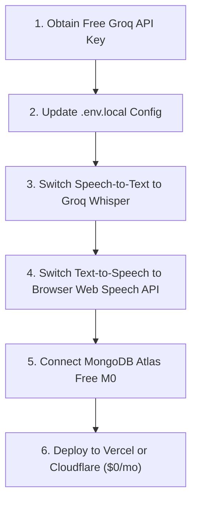

# 🚀 Career Pilot — Architecture Improvements & 100% Free All-in-One AI Blueprint

> **Document Version**: 1.0.0  
> **Target Project**: Career Pilot ([CareerPliot](file:///Users/aritra/Code/Hackathon/CareerPliot))  
> **Goal**: Eliminate all recurring subscription and API costs (VPS, paid custom LLM routers, Sarvam AI voice) by implementing a unified, high-performance, and **100% free tier architecture**.

---

## 📑 Table of Contents
1. [Executive Summary & Current Cost Audit](#1-executive-summary--current-cost-audit)
2. [Unified All-in-One AI Architecture](#2-unified-all-in-one-ai-architecture)
   - [Option A: Groq Cloud (Recommended Top Pick)](#option-a-groq-cloud-recommended-top-pick)
   - [Option B: Google Gemini API (Multimodal Powerhouse)](#option-b-google-gemini-api-multimodal-powerhouse)
   - [Option C: Local Ollama (100% Offline & Private)](#option-c-local-ollama-100-offline--private)
3. [Voice & Speech Subsystem Modernization](#3-voice--speech-subsystem-modernization)
4. [Zero-Cost Database Strategy](#4-zero-cost-database-strategy)
5. [Free Hosting & Serverless Deployment](#5-free-hosting--serverless-deployment)
6. [Built-In Free Services Audit](#6-built-in-free-services-audit)
7. [Step-by-Step Implementation Roadmap](#7-step-by-step-implementation-roadmap)
8. [Complete 100% Free `.env.local` Template](#8-complete-100-free-envlocal-template)

---

## 1. Executive Summary & Current Cost Audit

Currently, **Career Pilot** is configured for production on a paid VPS infrastructure with dependencies on paid AI and voice APIs. Below is a breakdown of what currently incurs costs versus the zero-cost replacement:

| Component | Current Setup | Current Cost | 100% Free Replacement | Free Cost |
| :--- | :--- | :--- | :--- | :--- |
| **LLM & Chat** | Custom Router (`zeus/claude-opus-5`, `posiden/deepseek-v4-flash`) | Paid per token | **Groq Cloud** (`llama-3.3-70b-versatile`) or **Gemini 2.0 Flash** | **$0.00** |
| **Speech-to-Text (STT)** | Sarvam AI (`saaras:v3`) | Paid per minute | **Groq Whisper** (`whisper-large-v3-turbo`) | **$0.00** |
| **Text-to-Speech (TTS)** | Sarvam AI (`bulbul:v3`) | Paid per character | **Browser Web Speech API** (`window.speechSynthesis`) | **$0.00** |
| **Hosting & SSL** | Dedicated VPS + Caddy reverse proxy | $5–$20 / month | **Vercel Hobby Tier** or **Cloudflare Pages/Workers** | **$0.00** |
| **Database** | MongoDB Atlas / Self-hosted Mongo | Variable | **MongoDB Atlas M0 Free Cluster** (512 MB forever) | **$0.00** |
| **Domain** | Custom domain (`careerpilot.cc`) | Annual renewal | **Vercel/Cloudflare Subdomain** (`*.vercel.app`) | **$0.00** |

---

## 2. Unified All-in-One AI Architecture

Career Pilot requires 4 core AI capabilities:
1. **Interactive Streaming Chat**: AI Study Hub tutor and conversational guidance.
2. **Strict Structured JSON**: Career assessment quizzes, milestone roadmaps, and ATS resume scoring rubrics.
3. **Speech Transcription (STT)**: User voice queries and speech-to-text.
4. **Document Reasoning**: Parsing uploaded resumes and study PDFs.

Instead of fragmenting the stack across multiple vendors, we can consolidate all AI workloads into a single provider.

---

### Option A: Groq Cloud (Recommended Top Pick)

Groq provides lightning-fast inference on LPUs (Language Processing Units) with generous free tier rate limits, supporting both LLMs and OpenAI Whisper audio models under **one single free API key**.

* **Website**: [console.groq.com](https://console.groq.com)
* **SDK Compatibility**: 100% compatible with the project's existing `openai` npm package.
* **Inference Speed**: ~300 to 500 tokens/sec (ideal for streaming chat UX).

#### Model Mapping:
- **Primary LLM**: `llama-3.3-70b-versatile` (Matches GPT-4o-level reasoning on career scoring and roadmap generation).
- **Fast / Fallback LLM**: `llama-3.1-8b-instant` (Ultra-low latency for quick classification and summaries).
- **Audio STT**: `whisper-large-v3-turbo` (Transcribes 30 seconds of speech in ~250ms).

#### Configuration:
```env
LLM_ROUTER_API_KEY=gsk_your_groq_api_key_here
LLM_ROUTER_BASE_URL=https://api.groq.com/openai/v1
LLM_ROUTER_MODEL=llama-3.3-70b-versatile
LLM_ROUTER_FALLBACK_MODEL=llama-3.1-8b-instant
```

---

### Option B: Google Gemini API (Multimodal Powerhouse)

If you plan to ingest large, 50+ page textbooks or academic papers into the AI Study Hub, Gemini provides an unmatched **1 Million+ token context window** for free.

* **Website**: [aistudio.google.com](https://aistudio.google.com)
* **Free Tier Quota**: 15 Requests Per Minute (RPM), 1,500 Requests Per Day (RPD).
* **Native Multimodal**: Directly understands complex documents and tabular data without requiring aggressive text chunking.

#### Configuration (using OpenAI-Compatible Gateway):
```env
LLM_ROUTER_API_KEY=AIzaSy_your_gemini_api_key_here
LLM_ROUTER_BASE_URL=https://generativelanguage.googleapis.com/v1beta/openai/
LLM_ROUTER_MODEL=gemini-1.5-flash
LLM_ROUTER_FALLBACK_MODEL=gemini-2.0-flash
```

---

### Option C: Local Ollama (100% Offline & Private)

For complete privacy and offline operation during live demonstrations where internet access might be unstable:

* **Prerequisites**: Mac with Apple Silicon (M1/M2/M3/M4) and Homebrew.
* **Setup**:
  ```bash
  brew install ollama
  ollama run llama3
  ```
* **Configuration**:
  ```env
  USE_LOCAL_OLLAMA=true
  OLLAMA_BASE_URL=http://localhost:11434/v1
  OLLAMA_MODEL=llama3
  ```

---

## 3. Voice & Speech Subsystem Modernization

### 3.1 Speech-to-Text (STT): Replace Sarvam with Groq Whisper
Currently, [`app/api/voice/transcribe/route.ts`](file:///Users/aritra/Code/Hackathon/CareerPliot/app/api/voice/transcribe/route.ts) sends audio to `api.sarvam.ai`. 

**Proposed Improvement**:
Use Groq's official Whisper endpoint via the existing `OpenAI` client:
```typescript
// app/api/voice/transcribe/route.ts
import { NextResponse } from "next/server";
import { auth } from "@/lib/auth";
import OpenAI from "openai";

const groq = new OpenAI({
  apiKey: process.env.LLM_ROUTER_API_KEY,
  baseURL: process.env.LLM_ROUTER_BASE_URL || "https://api.groq.com/openai/v1",
});

export async function POST(req: Request) {
  const session = await auth();
  if (!session?.user?.id) return NextResponse.json({ message: "Unauthorized" }, { status: 401 });

  const formData = await req.formData();
  const file = formData.get("file") as File;
  if (!file) return NextResponse.json({ message: "No audio file" }, { status: 400 });

  const transcription = await groq.audio.transcriptions.create({
    file: file,
    model: "whisper-large-v3-turbo",
    response_format: "json",
  });

  return NextResponse.json({ text: transcription.text });
}
```

### 3.2 Text-to-Speech (TTS): Leverage Built-In Browser Web Speech API
Instead of paying Sarvam AI per character in [`app/api/voice/speak/route.ts`](file:///Users/aritra/Code/Hackathon/CareerPliot/app/api/voice/speak/route.ts), use the browser's native `window.speechSynthesis`. 
* **Benefits**: Zero latency (no network round-trip), zero server load, supports multiple system voices (English, Hindi, Bengali, etc.), and **$0 cost**.
* The helper `speakWithBrowserTts()` is already present in [`components/voice/useVoice.ts`](file:///Users/aritra/Code/Hackathon/CareerPliot/components/voice/useVoice.ts#L32-L45).

---

## 4. Zero-Cost Database Strategy

### 4.1 Production: MongoDB Atlas M0 (Free Forever)
* **Storage**: 512 MB shared RAM & storage.
* **Cost**: $0.00 / month (no credit card required).
* **Storage Optimization**:
  - Store chat threads and roadmaps as lean JSON documents.
  - Apply TTL (Time-To-Live) indexes to ephemeral data like cached RSS tech news so storage never exceeds the 512 MB ceiling.

### 4.2 Local Development: In-Memory MongoDB Runner
The project already includes a zero-config offline database runner in [`scripts/local-mongo.mjs`](file:///Users/aritra/Code/Hackathon/CareerPliot/scripts/local-mongo.mjs):
```bash
npm run dev:local
```
This automatically boots `mongodb-memory-server` on `127.0.0.1:27017` with automatic seeding of demo data.

---

## 5. Free Hosting & Serverless Deployment

### Option 1: Vercel (Hobby Tier — Recommended)
* **Zero Maintenance**: Connect your GitHub repository to Vercel. Every push to `main` triggers an automatic build and deployment.
* **Included Features**: Automatic HTTPS, Global Edge CDN, Server Actions support, and a free `*.vercel.app` domain.
* **Required Build Settings**:
  - Framework Preset: `Next.js`
  - Node.js Version: `20.x`
  - Environment Variables: Add values from the template below.

### Option 2: Cloudflare Pages / Workers via OpenNext
* The codebase already contains [`@opennextjs/cloudflare`](file:///Users/aritra/Code/Hackathon/CareerPliot/package.json#L20) and `wrangler.jsonc`.
* Deploy directly to Cloudflare's global edge network using:
  ```bash
  npm run deploy
  ```

---

## 6. Built-In Free Services Audit

The following components in Career Pilot are already 100% free and require **no modification**:

| Service | Mechanism | Details |
| :--- | :--- | :--- |
| **Live Job Board** | Free Aggregators | Uses **Remotive**, **Arbeitnow**, and **RemoteOK** public APIs with zero API keys required ([lib/jobProviders.ts](file:///Users/aritra/Code/Hackathon/CareerPliot/lib/jobProviders.ts#L3)). |
| **Course Catalog** | Public Coursera API | Fetches from `api.coursera.org` with fallback deep-link search generators ([lib/courseProviders.ts](file:///Users/aritra/Code/Hackathon/CareerPliot/lib/courseProviders.ts#L43)). |
| **Tech News Feed** | RSS Parser | Aggregates public RSS feeds (TechCrunch, Hacker News, India Tech) directly into MongoDB with zero subscription costs. |
| **PDF Extraction** | Serverless PDF Parser | Uses `pdf-parse` and `pdfjs-dist` worker locally; no external OCR subscription needed for standard digital PDFs. |
| **Bot Protection** | hCaptcha Free Tier | Free plan supports up to 100,000 verifications/month, or bypass completely via `DEMO_MODE=true`. |

---

## 7. Step-by-Step Implementation Roadmap



1. **Step 1: Get a Free Groq Key**
   - Register at [console.groq.com](https://console.groq.com) and create an API key (`gsk_...`).
2. **Step 2: Update Local Environment**
   - Configure [.env.local](file:///Users/aritra/Code/Hackathon/CareerPliot/.env.local) with Groq endpoints and models.
3. **Step 3: Refactor Voice Routes**
   - Update [`app/api/voice/transcribe/route.ts`](file:///Users/aritra/Code/Hackathon/CareerPliot/app/api/voice/transcribe/route.ts) to forward audio files to Groq Whisper.
   - Remove `SARVAM_AI_API_KEY` dependencies.
4. **Step 4: Connect Cloud Database**
   - Create a free cluster on MongoDB Atlas and set `MONGODB_URI`.
5. **Step 5: Verify Build & Deploy**
   - Run `npm run build` locally to verify that all Server Actions and route handlers compile cleanly with Turbopack.
   - Deploy to Vercel or Cloudflare.

---

## 8. Complete 100% Free `.env.local` Template

Copy and paste the following into your [.env.local](file:///Users/aritra/Code/Hackathon/CareerPliot/.env.local) file for a complete, zero-cost operational environment:

```env
# ==============================================================================
# CAREER PILOT — 100% FREE TIER ENVIRONMENT CONFIGURATION
# ==============================================================================

# --- Application & Auth (Free & Open-Source) ---
# Generate secret using: openssl rand -base64 32
AUTH_SECRET=YVjSBtK/D0Z4aU4YJxssOzN+RdCloD08kcnXqUKzYb4=
NEXT_PUBLIC_SITE_URL=http://localhost:3000

# --- Database (Free: Local Memory or MongoDB Atlas M0) ---
# Local in-memory testing:
MONGODB_URI=mongodb://127.0.0.1:27017/careerpilot
# Production MongoDB Atlas M0 (Free forever):
# MONGODB_URI=mongodb+srv://<username>:<password>@cluster0.xxxxx.mongodb.net/careerpilot?retryWrites=true&w=majority

# --- All-in-One AI Engine: Groq Cloud (100% Free Tier) ---
# Free API key from https://console.groq.com/keys
LLM_ROUTER_API_KEY=gsk_your_groq_api_key_here
LLM_ROUTER_BASE_URL=https://api.groq.com/openai/v1
LLM_ROUTER_MODEL=llama-3.3-70b-versatile
LLM_ROUTER_FALLBACK_MODEL=llama-3.1-8b-instant

# --- Alternative AI: Local Ollama (Uncomment for 100% Offline Mode) ---
# USE_LOCAL_OLLAMA=false
# OLLAMA_BASE_URL=http://localhost:11434/v1
# OLLAMA_MODEL=llama3

# --- Demo & Development Mode ---
# Bypasses captcha and IP verification for instant testing
DEMO_MODE=true
DEMO_EMAIL=demo@careerpilot.com

# --- Bot Protection (Optional — Free up to 100,000 verifications/mo) ---
# https://dashboard.hcaptcha.com
# NEXT_PUBLIC_HCAPTCHA_SITE_KEY=
# HCAPTCHA_SECRET_KEY=

# --- Optional External Enhancements (Leave blank for default free fallbacks) ---
# YouTube course video cards (Free quota: 10,000 units/day from Google Cloud):
# YOUTUBE_API_KEY=
